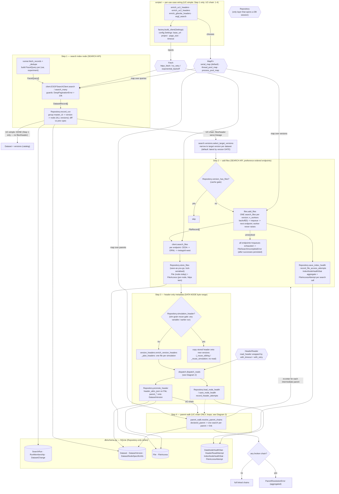
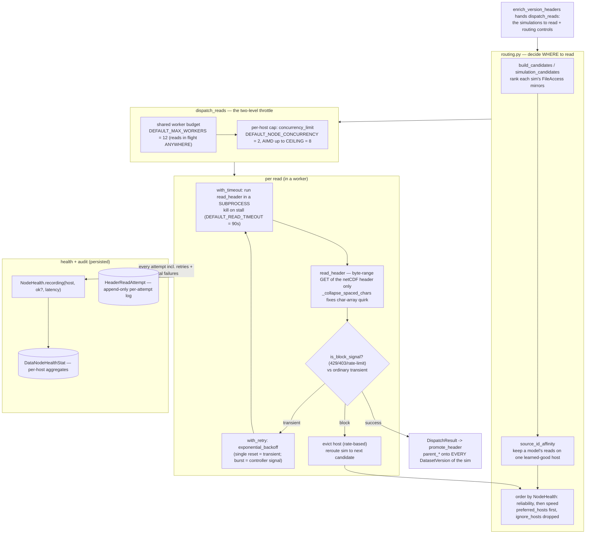
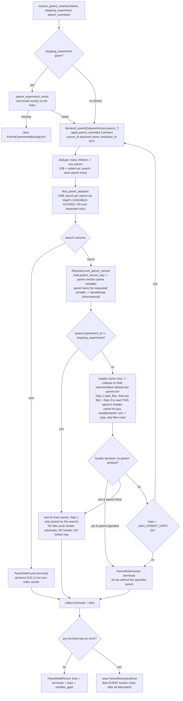
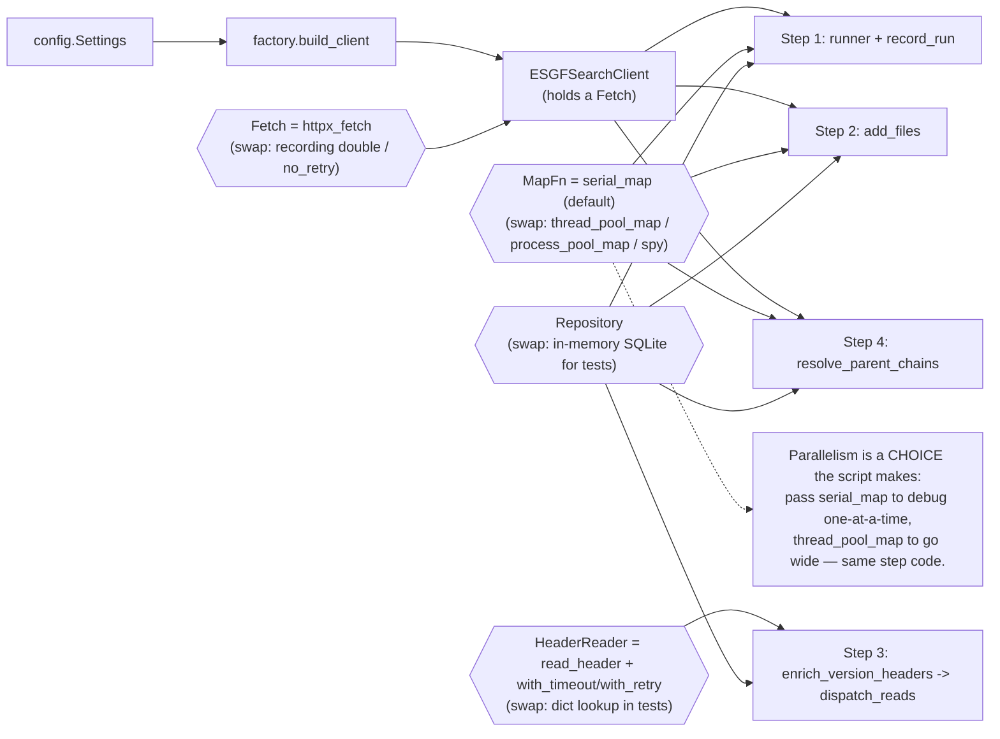

# Detailed workflow & call graph (CMIP6)

Status: **living document** — the *zoomed-in* companion to
[`search-workflow.md`](./search-workflow.md) (the ER model + the step-level flow)
and [`repository-layering.md`](./repository-layering.md) (who-may-call-whom by
layer). This file goes **down to the function names**: which concrete function
calls which, where the **injected seams** sit, where **parallelism** happens, and
which **tables** each write touches. It is deliberately busier than the other two —
the goal is to keep building a mental image, not to stay legible on one screen.

All Mermaid below is plain text (diff-able); GitHub renders it, or paste into
<https://mermaid.live>. Keep this file updated in the same commit as any change to
the call graph, seams, or parallelism.

> **Backend seam (ESGF1 / ESGF-NG).** The call graph below is drawn for ESGF1
> (esg-search / Solr). A fifth injected seam now sits under `ESGFSearchClient`: a
> **`SearchBackend`** (`esgf.backends`) resolved from the endpoint URL
> (`backends.detect`), so the same graph serves ESGF-NG (STAC / CQL2) with two
> substitutions — **Step 2** `files.add_files` becomes `files_ng.add_files_auto`,
> which for STAC records runs `add_files_from_assets` (an in-process transform of the
> item's `assets`, **no `search_files`, no `IndexNodeHealth`**) then the *unchanged*
> `store_files`; and every `client.search`/`count` renders to CQL2 instead of Solr
> params. Steps 3–4 (`enrich_version_headers`, `resolve_parent_chains`) are unchanged.
> See [`search-workflow.md`](./search-workflow.md#backends-esgf1-vs-esgf-ng) and
> [`esgf-ng-backend-adapter.md`](./esgf-ng-backend-adapter.md).

Legend for every diagram:

- **rounded box** = a function/callable you can grep for.
- **hexagon** `{{…}}` = an **injected seam** (dependency injection): the caller is
  handed *some* implementation, so behaviour (serial vs parallel, real vs fake) is
  swappable without touching the step. The four seams are `Fetch`, `MapFn`,
  `HeaderReader`, and `Repository`.
- **cylinder** `[( … )]` = a SQLite table (only `Repository` ever writes it).
- Edge labels say *what is passed* or *why the call happens*.

---

## 1. End-to-end call graph (all four steps)

The one picture: a `scripts/` entry point wires config, then drives the four
`search/` step functions in order. Each step reaches **left** to `esgf/` for the
network/read machinery and **down** to `Repository` for persistence. Nothing but
`Repository` touches a table.

**Reading it:** every step is the same shape — *cache gate → esgf call (through a
seam) → `Repository` write → table*. Health is recorded wherever we hit a flaky
server: **data-node** health in Step 3 (`DataNodeHealthStat`, header reads — the only step
that talks to data nodes) and **index-node** health in Step 2 (`IndexNodeHealthStat`,
the file searches, with its own backoff → requeue → endpoint fallback).

---

## 2. Step 3 internals — the header-read dispatcher (where the *real* parallelism is)

Steps 1/2/4 parallelise trivially (HTTP search over threads). Step 3 is the
interesting one: netCDF is **not thread-safe** and a stalled read must be **killed**,
so each read runs in a **subprocess** under a wall-clock timeout, across a shared
worker budget *and* a per-host concurrency cap, with health-aware routing and retry.

Key facts to remember from this diagram:

- **Two independent limits.** `DEFAULT_MAX_WORKERS` caps reads *everywhere*;
  `concurrency_limit` caps reads to *one host*. A host earns more parallelism
  (AIMD, up to the ceiling) only by succeeding, and loses it on block bursts.
- **Process, not thread.** `with_timeout` uses a subprocess purely so a hung
  `read_header` can be `_terminate`-d — `signal.alarm` and `.ncrc` tricks don't
  work here (that lesson is baked in).
- **Health persists across runs:** `load_node_health` at the start, `recording`
  per read, `save_node_health` at the end — so run *N+1* starts already knowing
  which mirrors are fast/dead.

---

## 3. Step 4 internals — the parent walk loop (function level)

The design doc has the *decision* flow; this is the *call* flow. Note it **re-uses**
Steps 2 and 3 for every hop — a parent is just another dataset that needs files and
a header read (to find *its* parent), until a terminal.

The **`parent_walk.py` variable question** is now settled as **fully variable-scoped**
(this reverses an earlier "variable-agnostic existence" design; the trade-off was taken
deliberately):

- **Existence / lineage** (`FIND`) is **variable-scoped**: it searches
  `(source_id, experiment_id, variant_label)` constrained to the requested variables (an
  OR). *Consequence:* a parent that publishes **none** of them comes back empty and so
  is a `ParentNotFound` — the walk cannot tell that apart from a parent that does not
  exist at all. (With a multi-variable request the OR is forgiving: the parent resolves
  as long as it publishes *at least one* requested variable.)
- **Files / header** (`NEEDHDR`) is **collapsed** to a single representative dataset per
  parent simulation (`_read_representative`) — a header describes the *run*, so any one
  file carries the same `parent_*` attributes and is enough to climb. This gate is what
  avoids the >50k file-access blow-up, and it is skipped entirely when the simulation's
  header is already stored (any variable, including an earlier run — `simulation_header`).

Each requested variable's child→parent version link is still made when the parent
publishes it; a requested variable the parent does *not* publish (while publishing
others) is reported as a `VariableGap` (the lineage resolved, that one variable's
lineage just has a hole at that ancestor) rather than failing the walk. The
**Gregory / uc2** multi-variable case therefore needs no special casing.

---

## 4. Dependency-injection map — what gets handed to what

The reason the diagrams above are swappable (real network in production, fakes in
tests) is that every step takes its collaborators as **parameters with defaults**,
not hard-coded imports. This is the whole seam story on one page.

**Takeaway:** to change *how parallel* the whole pipeline runs, a script swaps one
argument (`MapFn`). To make any step testable, you pass a fake `Fetch` /
`HeaderReader` / `Repository` — the step function never knows the difference. That is
what lets the per-step tests double as living documentation (see the "Testing &
observability" section of `search-workflow.md`).

---

## How this doc relates to the other two

| Doc | Altitude | Answers |
|---|---|---|
| `repository-layering.md` | zoomed **out** | which *layer* may call which |
| `search-workflow.md` | mid | the ER model + the 4-step *decision* flow + per-step call map |
| **this doc** | zoomed **in** | *function-level* call graph, the read dispatcher, the walk loop, and the DI seams |

1. End-to-end call graph (all 4 steps) — every step shown as the same shape: cache gate → esgf call through a seam → Repository write → table, with the concrete function names (runner.fetch_records, client.search_many, files.add_files, store_files, enrich_version_headers, promote_header, resolve_parent_chains, etc.) and which of the 4 table groups each write hits.
2. Step-3 read dispatcher internals — the real parallelism: routing/affinity/health ordering → the two-level throttle (DEFAULT_MAX_WORKERS=12 shared budget vs per-host concurrency_limit AIMD) → per-read subprocess timeout + block/transient classification + retry → persisted DataNodeHealthStat / HeaderReadAttempt.
3. Step-4 parent-walk loop at function level — resolve_parent_chains → declared_parent → existence gate → find_parent_datasets (one search per parent) → set_parent_version, re-using Steps 2/3 each hop, with all three terminals and the aggregated error.
4. Dependency-injection seam map — how Settings/factory build the client and how the four seams (Fetch, MapFn, HeaderReader, Repository) are handed to each step, making "how parallel" a one-argument choice.
