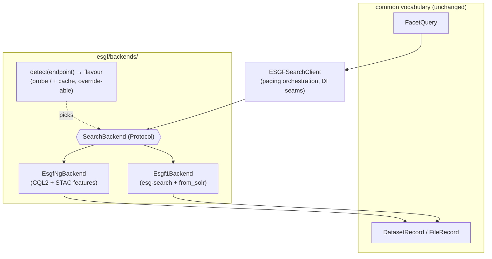
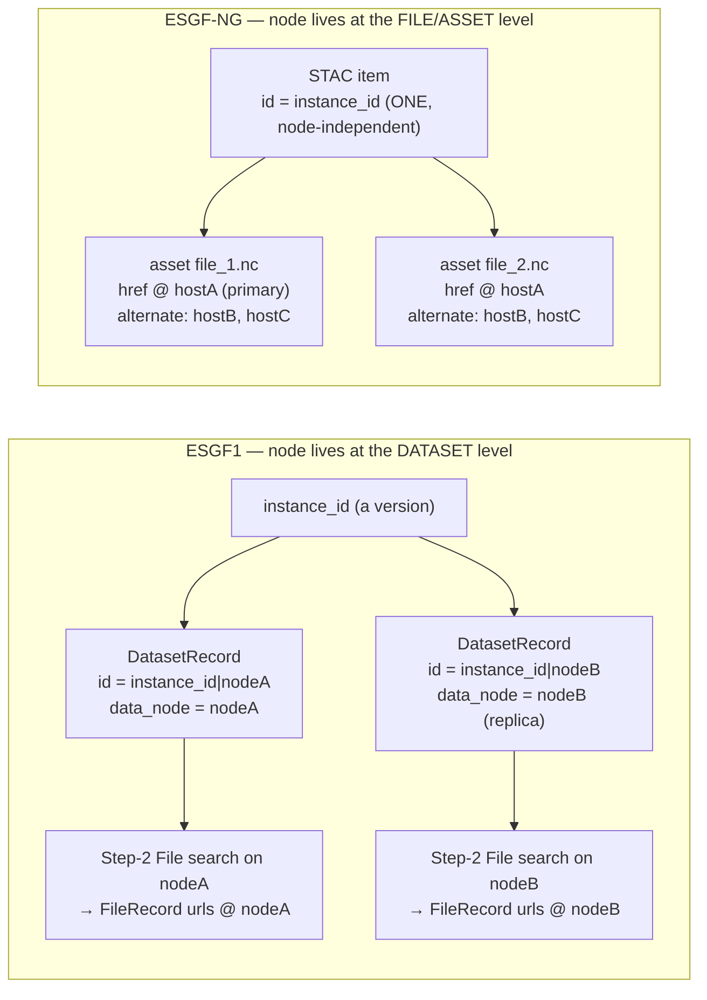

# ESGF1 / ESGF-NG backend adapter — design

Status: **BUILT (Phases 1–6 done, 2026-07-30)** — companion to
[`search-workflow.md`](./search-workflow.md) (the workflow this must slot into)
and [`repository-layering.md`](./repository-layering.md) (layer rules the adapter
must respect). Scope: **CMIP6 only, search Step 1 only** (files, data nodes and
parent-header resolution are explicitly out of scope here — see
[§6 What does *not* port](#6-what-does-not-port)). MIP-generation search
(CMIP5/CMIP7/CORDEX) is a separate step and is only noted where it shapes the
abstraction.

The findings below come from probing the live east endpoint
(`https://search.east.esgf.io`) on 2026-07-30. The **west** endpoint
(`https://search.west.esgf.io/search`) has **no data yet**, so its behaviour is
assumed-equal-to-east until we can confirm; every place where west may diverge is
flagged **⚠ west-unknown**.

## 0. The question this doc answers

The user goal: *"Search for this query using one of these search APIs"* — the user
names endpoints, **not** API flavours, and we translate. This doc records whether
that goal is reachable and what it costs.

**Verdict: reachable for the *search input vocabulary*, but the data-access /
file / data-node half of our mental model does not exist on ESGF-NG.** Users do
**not** need to hand-craft backend-specific queries (we hide that). Users **do**
need to understand that the "Step 1 datasets → Step 2 files across data nodes →
Step 3/4 parent headers" pipeline **collapses on ESGF-NG**: files arrive *inside*
the Step-1 dataset response as STAC assets, and there is no data-node / replica /
mirror dimension to rank or fall back across. See [§6](#6-what-does-not-port).

## 1. Terminology (precise)

- **ESGF1** — the current backend: the `esg-search` RESTful API returning **Solr
  JSON** (`response.docs[]`). Everything in `esgf/client.py`, `esgf/query.py`,
  `esgf/models.py` today speaks this.
- **ESGF-NG** — the next-generation backend: a **STAC API** (stac-fastapi;
  OGC API - Features + STAC item-search + CQL2 filter) returning **GeoJSON**
  (`FeatureCollection.features[]`). `search.east.esgf.io` is one deployment.
- **Backend** — a `(protocol flavour)` we talk to: `ESGF1` or `ESGF_NG`. A single
  logical index (east, CEDA, ORNL…) is served by exactly one backend flavour.
- **Collection** (ESGF-NG) — the STAC grouping that corresponds to our **project**
  facet. East currently exposes: `CMIP6`, `CMIP6Plus`, `CMIP7`, `CORDEX-CMIP6`,
  `obs4REF`.
- **Backend vocabulary** — the field names a backend actually accepts/returns
  (e.g. bare `variable_id` on ESGF1 vs collection-prefixed `cmip6:variable_id` on
  ESGF-NG). Contrast with the **common vocabulary** below.
- **Common vocabulary** — the backend-independent field names the user and the rest
  of the codebase use: `variable_id`, `experiment_id`, `source_id`,
  `variant_label`, `frequency`, `table_id`, `project`. Today this **is** the
  `FacetQuery` field set; we keep it as the neutral layer.

## 2. Side-by-side: how the two backends differ

Everything in this table was confirmed live against east except the west column.

| Concern | ESGF1 (esg-search / Solr) | ESGF-NG (STAC / east) |
|---|---|---|
| Root shape | esg-search RESTful | STAC `Catalog`, `conformsTo` advertises CQL2 + OGC Features + STAC item-search |
| Project selector | `project=CMIP6` facet | `collections=CMIP6` param |
| Facet filter | flat params: `variable_id=tas&experiment_id=historical` | **CQL2 filter**: `filter=cmip6:variable_id='tas' AND cmip6:experiment_id='historical'` |
| OR within a facet | comma list: `variable_id=tas,pr` | `cmip6:variable_id IN ('tas','pr')` |
| AND across facets | separate params | `AND` in the CQL2 expression |
| Field names | bare (`variable_id`) | **collection-prefixed** (`cmip6:variable_id`, `cordex-cmip6:variable_id`, `cmip7:…`) |
| Response envelope | `{"response": {"numFound", "docs": [...]}}` | `{"type":"FeatureCollection","numberMatched","numberReturned","features":[...]}` |
| One result = | one Solr doc (a dataset version **on one data node**) | one STAC `Feature` (a dataset version, **node-independent**) |
| Result id | `instance_id\|data_node` | STAC item `id` == our `instance_id` (no `\|data_node`) |
| Facet values live at | top level of the doc | `properties.{collection}:{field}` (prefixed) |
| `latest` / `retracted` | `latest`, `replica` facets/fields | `properties.latest`, `properties.retracted` (booleans) |
| Files | **separate** `type=File` search | **`assets`** map inside each item — direct `.nc` hrefs, `roles:["data"]`, plus `globus`/`HTTPServer` access |
| Data node / replica | first-class (`data_node`, `replica`, per-node ids) | **absent** — one catalog; asset hrefs point at a host but there is no replica/node facet |
| Pagination | `offset` + `limit`, `numFound`; **hard 10 000 offset cap** (HTTP 422) | opaque **`token`** on `rel=next` link; `numberMatched` for the total; **no offset cap observed** |
| Facet enumeration | Solr `facet_counts.facet_fields` (`facet_values()`) | STAC `/aggregations` + `/aggregate`, **fixed limited set** (arbitrary field-by-field rejected) |
| Free-text | Lucene `query=experiment_id:ssp*` | CQL2 / STAC free-text — **no Lucene equivalent** |

### 2.1 Concrete evidence (east, 2026-07-30)

CQL2 filter with counts and token paging:

```
GET /search?collections=CMIP6
    &filter=cmip6:variable_id='tas' AND cmip6:experiment_id='historical'
    &limit=2
→ 200 { "numberMatched": 149, "numberReturned": 2,
        "features": [...2...],
        "links": [ { "rel": "next",
                     "href": ".../search?...&token=Wy05MjIz..." }, ... ] }
```

`IN` for OR-within-facet: `filter=cmip6:variable_id IN ('tas','pr') AND cmip6:experiment_id='historical'` → `numberMatched: 300` (vs 149 for tas alone). Confirmed.

Bare facet params are **silently ignored**: `?collections=CMIP6&variable_id=tas` →
`numberMatched: 445722` (the whole collection). So we **must** emit CQL2; we cannot
lean on esg-search-style params.

A CMIP6 item's shape (trimmed):

```json
{
  "id": "CMIP6.CMIP.NIMS-KMA.UKESM1-0-LL.historical.r15i1p1f2.Amon.tas.gn.v20210510",
  "collection": "CMIP6",
  "properties": {
    "version": "20210510", "latest": true, "retracted": false, "size": 441101782,
    "cmip6:mip_era": "CMIP6", "cmip6:activity_id": ["CMIP"],
    "cmip6:source_id": "UKESM1-0-LL", "cmip6:experiment_id": "historical",
    "cmip6:variant_label": "r15i1p1f2", "cmip6:variable_id": "tas",
    "cmip6:table_id": "Amon", "cmip6:frequency": "mon", "cmip6:grid_label": "gn",
    "cmip6:institution_id": "NIMS-KMA", "cmip6:nominal_resolution": "250 km"
  },
  "assets": {
    "tas_Amon_UKESM1-0-LL_historical_r15i1p1f2_gn_185001-194912.nc":
      { "href": "https://dap.ceda.ac.uk/badc/.../...185001-194912.nc", "roles": ["data"] },
    "tas_Amon_UKESM1-0-LL_historical_r15i1p1f2_gn_195001-201412.nc":
      { "href": "https://dap.ceda.ac.uk/badc/.../...195001-201412.nc", "roles": ["data"] }
  }
}
```

Note: **files are already here** (two `.nc` assets), the id carries **no
`|data_node`**, and facet values sit under `cmip6:` prefixes.

## 3. Where the abstraction holds

The user-facing/common vocabulary is a **clean superset match** for the facets we
search on. `variable_id`, `experiment_id`, `source_id`, `variant_label`,
`frequency`, `table_id` all exist on both sides — only the *spelling* (prefix) and
the *filter grammar* differ. So the neutral `FacetQuery` needs **no new fields** for
CMIP6 search; it needs a per-backend **renderer** and **parser**. This is the part
of the user's assumption that is correct and worth preserving.

## 4. Proposed shape: a `SearchBackend` seam

Add a backend seam beneath `ESGFSearchClient`, so the client keeps its public
surface (`search`, `count`, `search_files`, `search_many`) and delegates the three
things that actually differ: **render params**, **iterate pages**, **parse docs**.



`SearchBackend` protocol (sketch — names, not final code):

- `render(query: FacetQuery, *, offset_or_token, limit) -> Request` — build URL +
  params for one page. ESGF1 uses `offset`; ESGF-NG uses `token` (see §5).
- `parse_page(payload) -> Page` — return `(records, total, next_cursor)`; hides
  Solr `numFound`/`offset` vs STAC `numberMatched`/`rel=next` token.
- `parse_dataset(doc) -> DatasetRecord`, `parse_file(doc) -> FileRecord`.
- `supports(feature) -> bool` for capabilities that don't port (free-text,
  facet enumeration, file-type search) so the client can raise a **clear**
  `UnsupportedOnBackend` instead of silently wrong results.

The existing `Fetch` / `MapFn` / `RetryPolicy` seams are **untouched** — they wrap a
single HTTP call and are backend-agnostic.

### 4.1 ESGF-NG parser mapping (STAC feature → `DatasetRecord`)

| `DatasetRecord` field | STAC source |
|---|---|
| `id` | `feature.id` (also serves as `instance_id`) |
| `instance_id` | `feature.id` |
| `master_id` | `feature.id` with trailing `.vYYYYMMDD` stripped (same rule as `master_key` today), or `properties.base_id` if present |
| `version` | `properties.version` |
| `latest` | `properties.latest` |
| `data_node` | **`None`** — no such concept (see §6) |
| `replica` | **`None`** |
| `project` | `feature.collection` |
| `source_id`, `experiment_id`, `variant_label`, `variable_id`, `frequency`, `table_id`, `grid_label`, `institution_id`, `nominal_resolution` | `properties["{collection_prefix}:{field}"]`, de-prefixed |
| `size` | `properties.size` |
| `number_of_files` | `len(assets with roles=['data'])` |
| `esgf_timestamp` | `properties.updated` (RFC3339) — modification detector |
| `raw` | whole feature |

The collection prefix is **derived from `feature.collection`** lower-cased
(`CMIP6` → `cmip6:`, `CORDEX-CMIP6` → `cordex-cmip6:`), so the same parser serves
every collection without a hard-coded prefix. `_single` still guards fields that
STAC returns as one-element lists (e.g. `cmip6:activity_id`).

### 4.2 ESGF-NG renderer (`FacetQuery` → CQL2)

- `project` → `collections={project}` param (not part of the filter).
- each populated facet → a CQL2 conjunct using the collection prefix:
  - single value → `{prefix}:{field}='{v}'`
  - multiple values → `{prefix}:{field} IN ('{v1}','{v2}')`
- conjuncts joined with ` AND `.
- `latest=True` → `AND {prefix}:… ` no — `latest` is a bare property:
  `AND latest=true` (⚠ confirm bare vs prefixed for `latest`/`retracted`).
- **value escaping**: single-quotes in values must be escaped per CQL2-text; CMIP6
  facet values don't contain quotes, but the renderer must handle it defensively.

### 4.2b Directives (user, 2026-07-30) that shape the NG backend

- **Translate NG → the ESGF1 `DatasetRecord` language for the *tables*, but keep the
  NG-native document in `raw`.** The normalised columns (`source_id`, `version`,
  `instance_id`, …) are populated by the NG parser exactly as ESGF1 does, so the DB
  schema and every downstream reader stay unchanged; but `DatasetRecord.raw` must
  retain the **STAC/CQL2 feature verbatim** (not a Solr-shaped translation), so no
  NG information is lost and the raw payload always reflects what the NG API actually
  returned. (`DatasetRecord.raw` already stores the source doc — the NG parser keeps
  the STAC feature there.)
- **The user never states ESGF1 vs ESGF-NG.** They (or we) supply a **ranked list of
  endpoint links** — today `(CEDA, ORNL, metagrid-west)` — which we extend with the
  NG endpoints. The endpoint *identity* determines the flavour (via detection/override,
  §7), and a user may name an endpoint they want to hit; that choice alone tells us
  whether it is ESGF1 or NG. Flavour never appears in user input.
- **East and west are separate `Flavour`s** (`ESGF_NG_EAST`/`ESGF_NG_WEST`) from the
  outset — they already diverge (§12) — but may share one implementation until west
  serves data and the divergence is pinned down.

### 4.3 Design principle: the collection/project is a **parameter, never a constant**

We build and test against **CMIP6 only** for now, but `"CMIP6"` (and the `cmip6:`
prefix) must appear **nowhere** as a literal in the render/parse logic — only ever as
a **default value**, exactly as `project` already is a `FacetQuery`/`Settings` default
today (and as `query.py`'s TODO and the `no-hardcoded-frequency` convention require).
Concretely:

- **Collection is the query's `project`.** The renderer emits `collections={project}`
  and derives the CQL2 prefix from it (`project.lower()` → `cmip6`, `cordex-cmip6`,
  `cmip7`…). The parser derives the prefix from `feature.collection`. No branch keys
  off the string `"CMIP6"`.
- **The prefix is computed, not tabled per-known-collection.** `CMIP6` → `cmip6:`,
  `CORDEX-CMIP6` → `cordex-cmip6:` both fall out of `collection.lower() + ":"`, so a
  new collection needs no code change to *render/parse* its facets.
- **Field-name vocabulary is the one CMIP6-shaped thing that remains** — `DatasetRecord`
  uses `source_id`/`experiment_id`/… which are CMIP/CMIP6 vocabulary (CMIP5 says
  `model`, etc.). That mapping is **not** ours to solve here: it is the separate
  *MIP-generation* step flagged in `query.py`. So we keep the CMIP6 field set,
  **parameterise the collection/prefix around it**, and leave a clean seam
  (a per-collection field map, defaulting to the CMIP6 identity map) for that later
  work — rather than hard-coding `cmip6:` into the mapping. Where the field map does
  not know a collection, fall back to the identity/prefix rule so CMIP6Plus/CMIP7
  (which share the CMIP6 vocabulary) already work untested.
- **`project="CMIP6"` stays a default, not a floor.** Nothing rejects a non-CMIP6
  collection; it is simply the only one we exercise until the MIP-generation step.

## 5. Pagination: two different contracts

`ESGFSearchClient._iter_docs` currently bakes in `offset += len(page)` and the
10 000 `DeepPaginationError` guard — both **ESGF1-specific**. Proposed:

- Lift paging into the backend via an opaque **cursor**: ESGF1's cursor is the next
  `offset`; ESGF-NG's cursor is the `token` extracted from the `rel=next` link
  (absent link ⇒ done). The client loops on "cursor is not None".
- `DeepPaginationError` / `MAX_RETRIEVABLE` become an **ESGF1 backend concern**.
  ESGF-NG showed no offset cap; it may still cap total token depth (⚠ unconfirmed,
  and **⚠ west-unknown**), so keep a soft `max_results` ceiling that raises the same
  "narrow the query" error rather than looping forever.
- `numberReturned == 0` before `numberMatched` reached ⇒ same silent-truncation
  guard we already raise on ESGF1.

## 6. What does *not* port (flag these to users, loudly)

These are the places the current mental model breaks. They are **out of scope for
this Step-1 increment** but must be documented so nobody assumes parity.

1. **Data node / replica / mirror.** ESGF-NG is a single node-independent catalog.
   `data_node`, `replica`, per-node ids, node-health ranking, endpoint fallback,
   blackhole-node tracking (`uc2_blackhole_nodes.json`), preflight node probing —
   **none of it has an ESGF-NG counterpart.** On ESGF-NG the closest thing to a
   "node" is the host inside an asset `href`, which is an access detail, not a
   search dimension.
2. **Step-2 File search.** There is no `type=File` query. Files are **assets on the
   Step-1 item**. So the Step-2 "find files across data nodes" phase collapses into
   "read the assets we already have." (A future increment can map assets →
   `FileRecord`; see the *Search + files-from-assets* option we deferred.)
3. **Parent-header resolution (Steps 3–4).** Our parent walk reads netCDF
   `parent_*` global attributes via HTTP byte-range on a chosen data node. On
   ESGF-NG the asset href still points at a real `.nc`, so the *technique* could
   work — but the *node-selection* machinery around it doesn't apply. Whether
   ESGF-NG exposes parentage in the item `properties` directly (removing the need
   for header reads) is **worth checking before we port** — CMIP7 is expected to.
4. **Free-text Lucene `query`.** The *Lucene syntax* itself (`experiment_id:(a OR
   b)`, boosts, `_text_` search) has no CQL2 equivalent, so a `FacetQuery.query` set
   against an ESGF-NG backend must raise `UnsupportedOnBackend`, not be silently
   dropped — the one *search-input* leak in the "hide the difference" goal.
   **But note:** the one thing we actually use free-text for — **prefix matching**
   like `experiment_id:ssp*` — *does* port, via CQL2 `cmip6:experiment_id LIKE
   'ssp%'` (confirmed on east: 53 951 matches, `advanced-comparison-operators`
   class). And it ports *better*: Solr's Lucene tokenises on hyphens and mis-matches
   names like `esm-hist`, which is why the code avoids wildcards today; CQL2 `LIKE`
   is a clean string match with no tokenisation. So prefix requirements can be a
   first-class facet on the NG backend rather than a free-text escape hatch.
5. **`replica` / `distrib` flags.** No meaning on a single catalog; raise or ignore
   explicitly.
6. **`facet_values()` enumeration.** Solr `facet_counts` → STAC `/aggregate`, which
   only supports a fixed aggregation set (e.g. `total_count`, `collection_frequency`;
   an arbitrary `source_id`-by-`frequency` request was rejected). The main use of
   enumeration — expanding an experiment prefix into an exact list — is largely
   **obviated by CQL2 `LIKE`** (item 4); other enumeration needs still want a
   different approach on ESGF-NG (⚠ design later).
7. **`count()` via `limit=0`.** ESGF1 counts with `limit=0` + `numFound`. ESGF-NG
   **rejects `limit=0`** (`limit` must be > 0); count with `limit=1` and read
   `numberMatched`. The backend must special-case this.
8. **Unknown/typo'd property.** Solr ignores an unknown facet; ESGF-NG CQL2 returns
   **0 matches silently** (e.g. `cmip6:not_a_field='x'` → `numberMatched: 0`, no
   error). So the NG renderer should validate facet names against `/queryables`
   (§12) rather than trust a silent zero.

## 7. Backend detection (decision: auto-detect + explicit override)

- **Auto-detect (default):** GET the endpoint root once. `type:"Catalog"` +
  `conformsTo` containing a STAC/OGC-Features URI ⇒ `ESGF_NG`; an esg-search
  response ⇒ `ESGF1`. Cache the verdict per endpoint (a `ProbeCache`-style memo) so
  it costs **one** request per endpoint per session. The user passes only URLs.
- **Explicit override:** allow config to pin an endpoint's flavour
  (`{url: ESGF_NG}`), which (a) makes offline/unit tests deterministic with **no
  probe**, and (b) lets us pin west the moment it comes online with possibly-
  different behaviour, before auto-detect is trustworthy there.
- Detection keys off the **endpoint URL root**, independent of the `/search` path,
  so both `https://search.east.esgf.io` and a bare host resolve the same.

## 8. Testing strategy

- **Offline unit** (must pass `--doctest-modules`, no network): recorded east
  payloads (one CMIP6 page + a `rel=next` page) as fixtures; assert the CQL2
  renderer output string and the STAC→`DatasetRecord` mapping. Use the **explicit
  override** so no probe fires.
- **Detection unit:** recorded root payloads for east (STAC) and CEDA (esg-search);
  assert the flavour verdict; assert override short-circuits the probe.
- **Live smoke** (opt-in, network): east `numberMatched` for a known query is
  `>0` and `<` collection total; one page round-trips to `DatasetRecord`s with the
  expected `variable_id`; `rel=next` advances. No exact-count assertions (data
  changes).
- **⚠ west:** no tests until it has data; the override lets us stub it.

## 9. Open questions / to confirm before coding

1. `latest` / `retracted` in CQL2 — **bare** (`latest=true`) or **prefixed**
   (`cmip6:...`)? (Root advertises them as top-level properties; needs one probe.)
2. Does ESGF-NG cap token-pagination depth (an NG analogue of the 10 000 wall)?
3. Are there `assets` roles beyond `data` we care about for Step 2 (`globus`,
   `HTTPServer`, `reference`/kerchunk)?
4. Does `properties` ever carry parentage directly (short-circuiting header reads)?
   **Answered (east, CMIP6): no** — items carry no `parent_*`/`branch_*` properties,
   so header reads are still required (see §10.3).
5. **west**: every east finding above is provisional for west until it serves data.

## 10. Steps 2/3/4 on ESGF-NG — the file/node mapping in detail

This section answers the three questions the abstraction hinges on: *where do
files come from, are they the same thing as data nodes, and what do we search on to
get a parent's header?* All confirmed live against east (CMIP6) on 2026-07-30.

### 10.1 Where the data-node dimension lives on each backend

The single most important shift: **the node/replica dimension moves down one level**,
from the *dataset* (ESGF1) to the *file asset* (ESGF-NG).



- **ESGF1:** one `instance_id` fans out into **N `DatasetRecord`s**, one per data
  node (`id = instance_id|data_node`). A replica is a *whole extra dataset record*.
  Step 2 then issues a **File search per version** (by node-specific `dataset_id`)
  to discover the files on each node.
- **ESGF-NG:** one `instance_id` is **one STAC item** (node-independent; item `id`
  *is* the `instance_id`). Its `assets` **are** the files, delivered *inside the
  Step-1 response*. The node/replica set is a **per-asset** property: the primary
  `href`'s host plus the alternate hosts under the STAC **alternate-assets**
  extension (`assets[f].alternate[*]`, each tagged `alternate:name: "<host>"`).

**So: assets ≈ files, not nodes.** The "node" equivalent is the **host** on each
asset href. Today east serves a single host per file (`ceda.ac.uk`, no populated
`alternate`), so it *looks* like one node per file, but the schema is built to carry
replicas — when they land, an asset simply gains alternate hrefs.

### 10.2 Step 2 (add files) — a network search on ESGF1, **free** on ESGF-NG

| | ESGF1 | ESGF-NG |
|---|---|---|
| How files are obtained | separate `type=File` **search** per version, with backoff → requeue → **endpoint fallback** (`search/files.py`) | **parse the `assets`** already on the Step-1 item — **no network call** |
| File identity | `FileRecord` from Solr file docs | one `File` per asset key (the filename) |
| File URLs (`FileAccess`) | `url\|mime\|service` entries, one host each | asset `href` (primary host) + each `alternate` href (other hosts) |
| Size / checksum / tracking | Solr fields | `file:size`, `file:checksum`, `cmip6:tracking_id` on the asset |
| Cross-index dataset-id portability pain (the "0 files if the fallback index doesn't know the node ids" trap — see memory `step2-cross-index-dataset-id-portability`) | **present** | **gone** — ids are node-independent and files are embedded |
| Index-node health / blackhole-node tracking / preflight probe *for the file search* | applies | **N/A** — there is no file search to make resilient |

Concretely, an east asset already carries everything Step 2 persists today:

```json
"tas_..._185001-194912.nc": {
  "href": "https://dap.ceda.ac.uk/badc/.../tas_..._185001-194912.nc",
  "type": "application/netcdf", "roles": ["data"],
  "file:size": 67429259,
  "file:checksum": "12200f63...2213",
  "alternate:name": "ceda.ac.uk",
  "cmip6:tracking_id": "hdl:21.14100/0fd0...6e3f"
}
```

**Implication:** on ESGF-NG, Step 2 becomes a pure *transform* (`assets → File` +
`FileAccess` rows) that we can run in-process the moment Step 1 returns. The entire
`add_files` resilience apparatus (backoff/requeue/endpoint-fallback, `IndexNodeHealth`,
`FileSearchAttempt`, `FileSearchIncompleteError`) has **no counterpart** — it exists
to survive a file *search* that ESGF-NG doesn't need.

### 10.3 Steps 3 & 4 (headers + parent walk) — the technique ports, the plumbing shrinks

**Parentage is not in the item.** Confirmed: CMIP6 east items expose **no**
`parent_*`/`branch_*` properties. So to walk the parent tree we **still read the
netCDF header** — exactly the current byte-range technique (`esgf.headers.read_header`),
which needs only a direct `.nc` URL. On ESGF-NG that URL is an **asset href**.

What Step 3 actually consumes today is *candidate URLs grouped by host*, pulled from
the persisted `FileAccess` rows (`version_headers._stored_candidates`), then ranked by
`NodeHealth.host_rank` and read with per-host fallback. Nothing about that changes —
**provided Step 2 has written `FileAccess` rows from the assets** (§10.2). So:

- **Step 3 (`enrich_version_headers`) is reused as-is.** The "hosts" it ranks and
  falls back across are the asset's primary + alternate hosts instead of the data
  nodes a file search found. With east serving one host today, there is effectively
  one candidate — fallback still works, there is just less to fall back to.
- **Step 4 (`resolve_parent_chains` / `parent_walk`) keeps its whole shape** — read
  header → `declared_parent` → search the parent simulation → link versions → repeat
  — with **two** substitutions:
  1. its per-hop **Step-2 file search** (`add_files`) is replaced by the
     assets-transform (files already came with the parent item in Step 1);
  2. its per-parent **index search** (`find_parent_datasets`) renders to **CQL2**
     against the STAC backend instead of esg-search facets.

**Answering "what do we search on to get the parent's header?"** — you do **not**
run a Step-2 file search. The flow per hop on ESGF-NG is:

```
child STAC item ──(assets)──► pick one .nc asset href
        │                              │
        │                     read_header (byte-range)  ── host = asset primary/alternate,
        │                              │                     ranked by NodeHealth
        ▼                     parent_source_id / parent_experiment_id / parent_variant_label
 CQL2 search the parent simulation (source_id, experiment_id, variant_label),
 variable-scoped ──► parent STAC item(s) WITH their own assets ──► repeat
```

The thing you *search on* for the next hop is the same `(source_id, experiment_id,
variant_label)` triple the header declares — only the rendering (CQL2 vs facets) and
the backend differ. The thing you *read* is an asset href, not a file-search URL.
Because item ids are node-independent, the cross-index portability failure mode Step 4
inherits from Step 2 on ESGF1 simply cannot occur on ESGF-NG.

### 10.4 Net effect on the workflow

| Workflow piece | ESGF1 | ESGF-NG |
|---|---|---|
| Step 1 search | esg-search facets → Solr | CQL2 → STAC (adapter) |
| Step 2 files | network File search + fallback | **assets transform, no network** |
| Step 3 header read | byte-range on file-search URLs, host-ranked | byte-range on **asset hrefs**, host-ranked (reused) |
| Step 4 parent walk | header → facet search → link | header → **CQL2** search → link (reused) |
| Node health / preflight / endpoint fallback | central to Steps 2–4 | only meaningful for the Step-3 header read; the Step-2 apparatus is dead weight |

## 11. Implementation plan (phased, workflow-integrated)

Sequenced so each phase is independently shippable, testable offline, and leaves the
ESGF1 path byte-for-byte unchanged until the backend seam is proven. Coverage stays
≥ 90 %, `mypy --strict` clean, markdown docstrings (repo conventions).

### Phase 0 — confirm the open questions (§9), no code
One probe each: `latest`/`retracted` bare-vs-prefixed in CQL2; token-depth cap;
asset roles beyond `data` (globus/HTTPServer/reference). Record answers in §9.

### Phase 1 — the backend seam (search only, ESGF1 behaviour frozen) — ✅ DONE (2026-07-30)

Built: `esgf/backends/base.py` (`SearchBackend` Protocol, `Flavour` enum with
**`ESGF1`/`ESGF_NG_EAST`/`ESGF_NG_WEST`** separated per the east/west finding, `Page`,
`Cursor`, `UnsupportedOnBackend`, and the `ESGFResponseError`/`DeepPaginationError`
contract errors); `esgf/backends/esgf1.py` (`Esgf1Backend` + the Solr helpers moved
verbatim). `ESGFSearchClient` now delegates request/page/parse to an injected
`backend` (defaulting to `Esgf1Backend`), walks pages via the opaque cursor, and
exposes a `flavour` property; `esgf.client` re-exports the errors + Solr helpers so
`async_client`/`files`/`parent_walk`/tests need no change. Verified: 312 unit tests +
all doctests green, `mypy --strict` clean, `ruff` clean, and a **live** CEDA search
round-trips (`count=37`, 37 `DatasetRecord`s, `data_node`/`version` intact) — ESGF1
behaviour unchanged. Original plan below.


- Add `esgf/backends/base.py`: `SearchBackend` `Protocol` + a `Flavour` enum
  (`ESGF1`, `ESGF_NG`) + `UnsupportedOnBackend(feature, flavour)`.
- Extract today's logic into `esgf/backends/esgf1.py` (`FacetQuery.to_params` +
  `from_solr` + Solr paging/`numFound`/`DeepPaginationError`) — **pure move, no
  behaviour change**, guarded by the existing tests.
- Re-seat `ESGFSearchClient` on the protocol: it keeps its public methods
  (`search`, `count`, `search_files`, `search_many`, `facet_values`) and delegates
  render / page-iterate / parse to an injected backend, defaulting to `Esgf1Backend`.
- **Exit test:** existing suite green unchanged; a client built with an explicit
  `Esgf1Backend` produces identical requests/records (golden-file the params).

### Phase 2 — the ESGF-NG search backend (Step 1 round-trip on real east data) — ✅ DONE (2026-07-30)

Built: `esgf/backends/esgf_ng.py` (`EsgfNgBackend`) + `DatasetRecord.from_stac` in
`models.py`. The renderer turns a `FacetQuery` into `collections=` + a **CQL2-text
filter** (prefix derived from `project`, `=`/`IN (...)`, **bare** `latest`, quote-
escaping), pages on the opaque `token` from the `rel="next"` link, counts with
`limit=1` (NG rejects `limit=0`), reads **both** `numberMatched`/`numMatched`
envelope keys (east/west), and raises `UnsupportedOnBackend` for free-text `query`,
`replica`/`distrib`, `dataset_id`, non-Dataset (File) search and facet enumeration.
`from_stac` populates the ESGF1 columns while keeping the **STAC feature verbatim in
`raw`** (`data_node`/`replica` = `None`, `number_of_files` from data assets). East↔west
share one impl; `lowercase_collection` is the only knob so far (west collections are
lower-case). §9 open questions 1 & 7 answered inline (latest/retracted **bare**;
`limit=0` rejected). Verified: 23 new offline unit tests (renderer strings, token
paging, both envelope keys, parser, guards) + full suite **363 green**, doctests,
`mypy --strict` + `ruff` clean, NG backend **96%** / total **95%** coverage; and a
**live east** round-trip through `ESGFSearchClient` — `count=74`, 74 records
token-paged with no dupes, **all 74 stored into the existing ESGF1 tables via
`record_run`** unchanged. Original plan below.


- `esgf/backends/esgf_ng.py` (**collection derived from the query/feature, never the
  literal `"CMIP6"` — see §4.3**):
  - **renderer** `FacetQuery → (collections param, CQL2 filter)` — prefix computed
    from `project` (`project.lower()+":"`), `=` for one value, `IN (...)` for many,
    ` AND ` join, value-escaping; raise `UnsupportedOnBackend` for `query`
    (free-text), `replica`, `distrib`.
  - **paging** on the opaque `token` from `rel=next` (cursor abstraction from §5);
    soft `max_results` ceiling reusing the "narrow the query" error.
  - **parser** STAC feature → `DatasetRecord` (mapping table §4.1); prefix from
    `feature.collection`; facet field-map defaults to the CMIP6 identity map with an
    identity/prefix fallback for unknown collections (§4.3); `data_node`/`replica` =
    `None`.
  - **count** via `limit=1` + `numberMatched` (ESGF-NG rejects `limit=0`; §6 item 7).
- Config: add flavour to the endpoint model; `Settings`/`factory` accept east URLs.
- **Tests:** offline unit on recorded east fixtures (renderer string + parser +
  two-page token paging); opt-in live smoke (`numberMatched` sane, page → records,
  `rel=next` advances). Explicit-override so no probe fires offline.
- **Exit:** `build_client(east).search(FacetQuery(...))` returns `DatasetRecord`s
  from live east into the existing DB via the unchanged repository.

### Phase 3 — backend auto-detection (+ explicit override) — ✅ DONE (2026-07-30)

Built: `esgf/backends/detect.py` — `detect_flavour` resolves a base URL to a `Flavour`
by **override → known-host registry → root probe** precedence, memoised in a
`DetectionCache`; `backend_for`/`resolve_backend` return a ready `SearchBackend`
(west ⇒ `lowercase_collection=True`). The registry maps every endpoint we ship
(CEDA/ORNL/metagrid = ESGF1; search.east/api.stac.ceda = east; search.west/
esgf-west.org = west), so the ranked links resolve **with no probe**; only an unknown
host is probed once (STAC `Catalog` + CQL2/OGC-Features ⇒ NG, `west` in host ⇒ west,
else default ESGF1). `config.py` gained `EAST_BASE_URL`/`WEST_BASE_URL`.
`factory.build_client` and `build_file_search_clients` now auto-resolve the backend
per endpoint (a shared cache across a ranked list), accept `flavour_overrides` and an
explicit `backend`, and default unchanged for ESGF1. Verified: 20 new offline tests
(registry-no-probe, override-wins, STAC/Solr/failure probe, cache short-circuit,
east/west, factory wiring) + full suite **383 green**, doctests, `mypy --strict` +
`ruff` clean, detect.py **95%** / total **95%**; and a **live** mixed ranked list —
`build_client(CEDA)` ⇒ `esgf1` (count 37) and `build_client(EAST)` ⇒ `esgf-ng-east`
(count 19) from the **same `FacetQuery`, URLs only, dialect never stated**. Original
plan below.


- `esgf/backends/detect.py`: probe endpoint root once, cache per-endpoint
  (`ProbeCache`-style); STAC `Catalog`+`conformsTo` ⇒ `ESGF_NG`, esg-search ⇒
  `ESGF1`. Config map pins/overrides a flavour (deterministic offline).
- `factory.build_client` / `build_file_search_clients` resolve flavour via detect
  (override wins) and inject the right backend.
- **Tests:** recorded root payloads (east + CEDA) → correct verdict; override
  short-circuits the probe.
- **Exit:** user passes only URLs (east and CEDA mixed); each is handled correctly.

### Phase 4 — Step 2 as an assets transform on ESGF-NG — ✅ DONE (2026-07-30)

**No schema change needed** — the schema is already node-independent: `File` has no
`data_node` and `FileAccess.data_node` is already nullable. Built `search/files_ng.py`:
`file_records_from_dataset` turns a STAC item's data-role `assets` into `FileRecord`s
(one per file; primary `href` + alternate-asset hrefs → the `url|mime|service` access
entries, host = URL host; `file:size`/`file:checksum`/`{prefix}:tracking_id` derived,
prefix from the item's collection; non-http/Globus-only and non-data assets skipped);
`add_files_from_assets` groups by version, transforms and persists via the **unchanged**
`Repository.store_files`, returning the same `AddFilesResult` (no failure/overflow mode
— files are already in hand, no network, no `IndexNodeHealth`). `is_stac_record` lets a
caller route ESGF1-search vs NG-transform. Verified: 6 offline tests incl. the
**alternate-assets multi-host** (replica) case east can't yet show + non-data/Globus
skipping + cache-skip + store round-trip; full suite **389 green**, doctests,
`mypy --strict` + `ruff` clean, files_ng **100%** / total **95%**. And a **live east**
end-to-end: search → `add_files_from_assets` (stored 2 files, 0 failures, no network) →
`get_version_files` returns byte-range URLs (host `dap.ceda.ac.uk`, `HTTPServer`) →
**`read_header` on the asset URL succeeds**, returning real parentage
(`parent_experiment_id=piControl`) — Step 3 runs unchanged and Phase 5 is unblocked.
Original plan below.


- Add `search/files_ng.py` (or a backend branch in `add_files`): STAC item `assets`
  → `File` + `FileAccess` rows (`href`+`alternate` hosts, `file:size`,
  `file:checksum`, `{prefix}:tracking_id` — prefix derived from the item's
  `collection`, not the literal `cmip6:`; §4.3), **no network, no `IndexNodeHealth`**.
- The workflow runner picks the transform when the Step-1 backend is `ESGF_NG`,
  the searching `add_files` when `ESGF1`. `FileSearchAttempt`/health untouched on
  the ESGF1 path.
- **Tests:** recorded multi-asset east item → expected `File`/`FileAccess` rows
  (incl. an item with populated `alternate` once we can capture/synthesise one).
- **Exit:** after a Step-1 ESGF-NG search, `get_version_files` returns the files
  with byte-range-ready URLs — **Step 3 can run with zero changes.**

### Phase 5 — parent walk on ESGF-NG (Steps 3–4 end to end) — ✅ DONE (2026-07-30)

Built: `add_files_auto` in `search/files_ng.py` — a Step-2 dispatch seam that routes to
the assets transform when records are STAC (`is_stac_record`) and to the ESGF1 network
`add_files` otherwise. `parent_walk._read_headers` now calls `add_files_auto` (so each
hop's file step is dialect-correct); `enrich_version_headers` is **unchanged** (it reads
the asset URLs the transform stored, host-ranked). `find_parent_datasets` already renders
its per-parent search to CQL2 through the backend seam; its ESGF1-only `replica=False`
deep-page fallback is now guarded (`UnsupportedOnBackend` ⇒ empty) so it can't crash an
NG walk. Verified: a new offline NG one-hop walk test (STAC records, files-from-assets, no
`search_files`) + the **24 existing ESGF1 walk tests unchanged** + full suite **390 green**,
doctests, `mypy --strict` + `ruff` clean, files_ng **100%** / total **95%**. And a **live
east UC-chain**: child `historical r15i1p1f2` (NIMS-KMA) → **1 hop** → parent `piControl
r1i1p1f2` (MOHC — parent institution *discovered from the netCDF header*, not assumed),
terminating at the `piControl` stopping experiment — Step 1 (CQL2) → Step 2 (assets, no
file search) → Step 3 (header read off an asset URL) → Step 4 (CQL2 parent search + link),
entirely through ESGF-NG. Original plan below.


- Verify `enrich_version_headers` reads headers from asset-sourced `FileAccess`
  unchanged (it should — it is URL/host-driven).
- Point `resolve_parent_chains` per-hop file step at the Phase-4 transform when the
  backend is `ESGF_NG` (skip `add_files`); `find_parent_datasets` already flows
  through the backend seam, so its search renders to CQL2 automatically.
- **Tests:** offline walk over recorded east items with synthetic `parent_*`
  headers (reuse the existing header-read fakes); assert the same links/terminals as
  the ESGF1 walk on equivalent data. Opt-in live mini-walk on east.
- **Exit:** a UC-chain use case resolves a parent chain entirely through east.

### Phase 6 — docs, deferrals, west — ✅ DONE (2026-07-30)

Done: `search-workflow.md` gained a **Backends: ESGF1 vs ESGF-NG** section (per-step
table, node-moves-to-file, Step-2-transform, the `UnsupportedOnBackend` user-visible
leaks, east≠west) and its scope line now says the integration is built;
`detailed-workflow.md` gained a backend-seam callout on the call graph
(`add_files`→`add_files_auto`, CQL2 rendering, Steps 3–4 unchanged). **west validated
live** behind the registry/override even with no data: `build_client(WEST_BASE_URL)`
resolves to `esgf-ng-west` (`lowercase_collection=True`), and `count`/`search` return
`0` gracefully via the `numMatched` envelope key — so the west path (lowercase
collection + west envelope) is exercised and correct ahead of data landing.
**Deferred (unchanged):** `facet_values` on ESGF-NG (STAC `/aggregate`) — raises
`UnsupportedOnBackend` for now; MIP-generation search (CMIP5/CMIP7/CORDEX) is a
separate step. **Re-verify against west** (item/property/asset shape, alternate
assets) the moment it serves CMIP6 data. Original plan below.


- Update `search-workflow.md` / `detailed-workflow.md` with the backend seam and
  the Step-2-collapses-to-a-transform branch; document the **user-visible
  leak**: free-text `query` and `replica`/`distrib` are ESGF1-only
  (`UnsupportedOnBackend`).
- Defer: `facet_values` on ESGF-NG (STAC `/aggregate`), needed for experiment
  prefix-expansion (§6.6); MIP-generation search (CMIP5/7/CORDEX) is a separate step.
- **west:** bring up behind the explicit-override the moment it serves data; re-run
  Phase-2/4 fixtures against it to catch east/west divergence.

## 12. CQL2 (ESGF-NG) vs Solr params (ESGF1), and east vs west

**What CQL2 *is*.** CQL2 (OGC *Common Query Language* v2, the query language of *OGC
API - Features Part 3: Filtering*) is a standardised, **typed filter-expression
language** — a SQL-`WHERE`-like grammar that is backend-agnostic. It is sent as a
`filter=` parameter, evaluated against the properties a collection advertises at
`/collections/{id}/queryables` (east lists 64 for CMIP6). Two interchangeable
encodings, both confirmed on east:

- **CQL2-Text** (human): `cmip6:variable_id = 'tas' AND cmip6:experiment_id LIKE 'ssp%'`
- **CQL2-JSON** (AST): `{"op":"=","args":[{"property":"cmip6:variable_id"},"tas"]}`
  (send `filter-lang=cql2-json`).

**What Solr/esg-search *is* by contrast.** ESGF1 is **not** a query language at all —
it is a fixed set of flat `key=value` HTTP params interpreted by Apache Solr behind
the esg-search proxy: `variable_id=tas&experiment_id=historical`. Same-facet
comma-list = OR, distinct params = implicit AND. There are no general
boolean/comparison operators; the only escape hatch is `query=`, handed to Solr's
**Lucene** parser (`experiment_id:ssp*`).

| Aspect | Solr params (ESGF1) | CQL2 (ESGF-NG) |
|---|---|---|
| Paradigm | fixed facet params | general typed filter *language* (OGC standard) |
| Combine | comma = OR, param = AND (implicit) | explicit `AND`/`OR`/`NOT`, parentheses |
| Operators | equality only (+ Lucene free-text) | `=` `<>` `<` `>` `IN` `BETWEEN` `LIKE` `IS NULL`, spatial/temporal |
| Field names | bare (`variable_id`) | collection-prefixed, declared in `/queryables` |
| Encodings | one (URL params) | two (text + JSON) |
| Count | `limit=0` + `numFound` | `limit≥1` + `numberMatched` (`limit=0` rejected) |
| Unknown field | ignored | **silent 0 matches** |
| Prefix match | Lucene `ssp*` (hyphen-tokenisation quirks) | `LIKE 'ssp%'` (clean) |

The crucial point for us: our `FacetQuery` only ever uses the **equality + AND + OR**
subset, which **both** dialects express — that is exactly why one common vocabulary
maps to both. CQL2 is strictly more expressive; we translate *into* the small corner
of it we need. (The expressiveness is upside, not obligation: `LIKE` cleanly solves
the experiment-prefix problem Solr forced us to work around — §6 item 4.)

**East vs west — CONFIRMED already different (probed 2026-07-30).** Live endpoints:
`search.east.esgf.io` → `api.stac.esgf.ceda.ac.uk` (CEDA-hosted), `search.west.esgf.io`
→ `discovery.production.esgf-west.org`. Both are `stac-fastapi`, but they are **not
byte-identical**, so we separate them from day one:

| | EAST | WEST |
|---|---|---|
| Root title | `ESGF EAST STAC API` | generic `stac-fastapi` |
| Collection ids | `CMIP6`, `CMIP6Plus`, `CMIP7`, `CORDEX-CMIP6`, `obs4REF` | **lower-case** `cmip6`, `cmip6plus`, `cmip7`, `cordex-cmip6`, `obs4ref` |
| Result envelope | `numberMatched` / `numberReturned` | **`numMatched` / `numReturned`** (+ a `context` block) |
| Conformance classes | superset (adds `collection-search`, `item-search#query/#sort/#fields`, `simple-query`) | subset (core CQL2 + features only) |
| Data | CMIP6 populated (e.g. tas/historical = 149) | **empty** (queryables empty, 0 matches) |

So the count/paging **parser field name differs** (`numberMatched` vs `numMatched`),
the **collection id casing differs**, and the **capability profile differs** — three
concrete reasons east and west need separate handling even though they share the STAC
protocol. West's *item/property/asset* shape is still unconfirmed (no data), so its
prefix and alternate-assets behaviour remain **⚠ west-unknown**. This vindicates the
plan's decision to model east and west as **separate `Flavour`s** (§4.3 / Phase 1),
even while we let them share code until west diverges further.

The user's "similar but not identical" intuition is right, and the reason is
architectural. ESGF1 mirrors
(CEDA/ORNL/metagrid) all speak the *same* Solr param dialect, so they are
interchangeable. ESGF-NG deployments instead speak **self-describing standards**,
and each deployment advertises its own **capability profile** — so east and west are
the *same protocol* but potentially *different profiles*. Two endpoints tell us the
profile before we ever query for data:

- **`conformsTo`** (root) lists the exact CQL2/STAC conformance classes implemented.
  East advertises `basic-cql2`, **`advanced-comparison-operators`** (that is what
  makes `LIKE`/`IN`/`BETWEEN` legal), `cql2-text`, `cql2-json`, `item-search#sort`,
  collection-search, etc. West could advertise a **subset** (e.g. basic only — no
  `LIKE`), or a different STAC/CQL2 version.
- **`/queryables`** (per collection) lists the filterable properties and their types.
  West may expose different collections, different property prefixes, or a different
  field set.

Likely axes of east/west divergence (all discoverable, none assumable):

1. **Collections offered** (east: `CMIP6`, `CMIP6Plus`, `CMIP7`, `CORDEX-CMIP6`,
   `obs4REF`; west may differ).
2. **Which conformance classes** are enabled (→ whether `LIKE`, sort, aggregation work).
3. **Queryable property set / prefixes** per collection.
4. **Pagination token** encoding (opaque either way — **never parse it**, always
   follow `rel=next`).
5. **Replica / asset coverage** (west may hold different replicas → different hosts
   in the alternate assets, i.e. a different Step-3 host set).
6. **Server version / quirks** (default `limit` cap, the `limit=0` rule, error
   payload shape, default sort) — east reports `stac-fastapi`; west could run a
   different build.

**Design consequence:** the adapter must **not** hard-code east's behaviour. East and
west are the **same `ESGF_NG` flavour, capability-parameterised**: at detection time
(Phase 3) read `conformsTo` (and, lazily, `/queryables`) to learn what an endpoint
supports, then render defensively — e.g. only emit `LIKE` when
`advanced-comparison-operators` is present, validate facet names against
`/queryables` rather than trusting a silent-zero, and treat the token as opaque. The
explicit-override then lets us pin or patch west the moment it serves data, before
auto-detection of its quirks is trustworthy.

### Sequencing / risk notes
- Phases 1–3 are additive and reversible; the ESGF1 path is untouched until a client
  is explicitly built on the NG backend.
- Phase 4 is the schema-touch point (files without a data node). Keep `data_node`
  nullable and let `File`/`FileAccess` carry a host without a dataset-level node —
  verify the repository doesn't assume a non-null `data_node` anywhere on the write
  path before starting Phase 4.
- Biggest unknown remaining: **replica behaviour** (populated `alternate` assets) is
  unobservable on east today; Phase 4 must be written to the schema and tested with a
  synthesised multi-host asset, then re-verified when real replicas or west appear.
