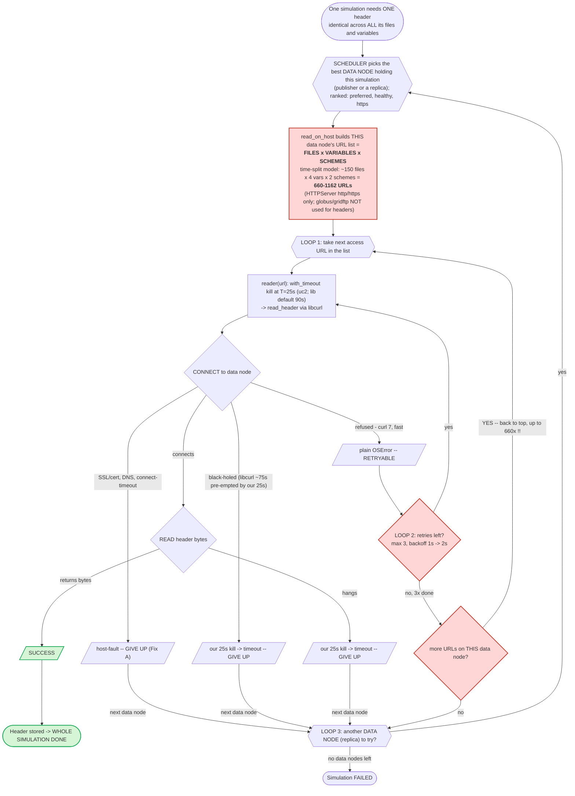

# Header-read flow: successes, stalls, retries, and the death spiral

**One simulation needs exactly ONE header.** The netCDF global attributes (`parent_*`, etc.)
are **identical across every file and every variable** of a simulation — so a single
successful read of *any* one file answers the whole simulation.

The cost blows up because of **nested loops that multiply**.

## Terminology (precise)

- **Simulation** — one `(source_id, experiment_id, variant_label)` run, e.g.
  `EC-Earth3-CC abrupt-4xCO2 r1i1p1f1`. Its header is identical across all its files/variables.
- **Data node** — an ESGF server that serves the files over HTTP.
- **Replica** — a copy of the same dataset published on an *additional* data node. A
  simulation's files are usually available on **several data nodes** (the original publisher
  plus replicas), so if one data node fails we try **another data node that holds a copy**.
  (Earlier drafts loosely called this a "mirror"; this doc uses **data node / replica** to
  match the codebase's terms.)
- **File** — one netCDF file. Large variables are split into many time-chunked files
  (e.g. one file per year), so a single variable can be ~150 files.
- **Access URL** — one downloadable URL for a file on a data node. The same file is often
  offered as both `https` and `http` (HTTPServer). Globus/GridFTP URLs exist but are **not**
  used for header reads.

## Timeouts (knob A), precisely

- Knob **A** is `with_timeout(reader, seconds=T)` — a wall-clock kill of the read subprocess.
- **T = 25s for this uc2 run** (`READ_TIMEOUT_FALLBACK`). The library default
  `DEFAULT_READ_TIMEOUT` is **90s**; uc2 overrides it to 25s, which is why 90s does not appear
  below — it is the *same* knob, a different value. (On a warm run, T is sized from the
  slowest healthy read actually observed.)
- Inside that step, **libcurl/the OS has its own ~75s connect timeout** for a black-holed
  connect; our `T`=25s kill fires first and **pre-empts** it. So "black-holed → 25s kill" in
  the chart is our deadline winning the race against curl's ~75s.

## The flow



## Why a dead data node goes into a death spiral

There are **three nested loops**:

| Loop | Where | Iterations for a time-split model |
|------|-------|-----------------------------------|
| LOOP 3 | data nodes (publisher + replicas) | a few |
| **LOOP 1** | access URLs on one data node = **files × variables × schemes** | **660–1162** |
| LOOP 2 | retries per URL | 3 (backoff 1s → 2s) |

For a **healthy** data node this is cheap — LOOP 1 succeeds on the **first** URL and returns.

For a **dead data node that fails with a RETRYABLE error (connection refused)**, they
**multiply**:

```
660 URLs  ×  3 retries  ×  (~0.3s fail + ~3s backoff)  ≈  ~36 minutes
```

…all **single-threaded inside one `read_on_host` call**, for **one data node of one
simulation**. And because it never finishes that data node, the simulation never advances to
the **CEDA data node that actually works** — so a *readable* sim looks "stuck/failed".

## Connect stall vs read stall

- **Stalling while *connecting*** → the `CONNECT` step. Bounded by our 25s (`T`) kill
  (→ timeout, GIVE UP). A libcurl connect-timeout under 25s is also caught by Fix A as a
  host-fault.
- **Stalling *once connected*** → the `READ` step. Also bounded by our 25s kill (→ GIVE UP).
- **Access schemes** → header reads use **HTTPServer only** (https + its http twin);
  **globus/gridftp are not tried** for headers, so schemes is just a ×2 factor.

## Where we can make choices (the 5 knobs)

| Knob | What it multiplies | Status / choice |
|------|--------------------|-----------------|
| **A — timeout (T=25s; lib default 90s)** | bounds a *connect stall* and a *read stall* | ✅ chosen (25s); healthy reads <2s |
| **B — retries ×3** | amplifies a RETRYABLE failure (refused) | ✅ keep for *refused* (this is what retries are for) |
| **C — schemes ×2** | https + http twin per file | 🟡 minor; small fixed factor |
| **D — variables ×4** | pools tas/rsut/rlut/rsdt files | 🔴 **UNNECESSARY** — header is identical across variables |
| **E — files ×~150** | pools every time-split yearly file | 🔴 **UNNECESSARY** — header is identical across files |

## The fix falls out of the chart

The killers are **D × E** — pooling **all variables × all yearly files** into LOOP 1, when the
header is identical across all of them and we only need **one**. So the fix is to **collapse
LOOP 1**: build the data node's URL list from just **one representative file** (its https +
http twin), not all 660–1162.

```
BEFORE:  Build = files(150) × vars(4) × schemes(2)  = 660–1162 URLs
AFTER:   Build = 1 file × schemes(2)  (+ a tiny fallback)  = ~2–6 URLs
```

Effects:

- a dead data node is bounded to a handful of attempts → **next data node in seconds**;
- the starved sims reach the working CEDA data node → they likely **succeed** (129 → ~134);
- knobs A and B are untouched (25s stall bound stays; refused keeps its retries);
- healthy reads are unaffected (they already succeed on URL #1).
```
