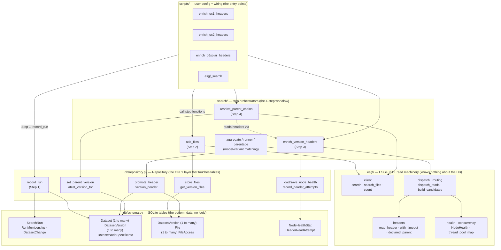

# Repository layering — how the pieces stack

An initial, deliberately-simplified view of how `cmip_data_manager` is layered, to
get a feel for **what sits at the bottom (the DB tables), where the functions fit,
and who is allowed to talk to whom**.

The one rule that makes the layering readable: **`Repository` is the only layer that
touches the database.** Everything above it (scripts, the search step-functions, the
ESGF I/O helpers) goes *through* `Repository`; nothing else imports the tables or
opens a session. The tables themselves (`db/schema.py`) are plain declarations with
no logic.

## Reading the diagram top-to-bottom

- **`scripts/` (top).** Thin, per-use-case config + wiring. They pick a query,
  choose preferred/ignored nodes and concurrency, and call the step functions in
  order. No business logic lives here — swap a script for a notebook and nothing
  else changes.

- **`search/` (step orchestrators).** One function per workflow step. Each function
  is the "what happens in this step" — it uses the `esgf/` layer for the network and
  the `Repository` for persistence, but never opens a DB session itself:
  - `add_files` — **Step 2**, one file search per version → `store_files`;
  - `enrich_version_headers` — **Step 3**, read one header per simulation from the
    stored file URLs → `promote_header`;
  - `resolve_parent_chains` — **Step 4**, walk the parent tree, one search per
    parent, linking child version → parent version;
  - `aggregate` / `runner` / `parentage` — a separate feature (which model-variants
    satisfy a multi-variable/experiment request); it also goes through `Repository`.

- **`esgf/` (I/O + read machinery).** Everything about *talking to ESGF and reading
  netCDF*: the search `client`, the `dispatch`/`routing` that spreads header reads
  across nodes, `read_header` with its per-read subprocess timeout/retry, and the
  `NodeHealth` learning. **This layer has no idea the database exists** — it takes
  records/URLs in and hands results back.

- **`db/repository.py` (`Repository`).** The single gateway to storage. Every write
  and every cached read is a method here; it validates, upserts, diffs runs, and
  maps between in-memory records and rows. **If a table is being written, a
  `Repository` method did it.**

- **`db/schema.py` (bottom — the tables).** The actual SQLite tables and their
  foreign keys — just data. `(1 to many)` marks a one-to-many key relationship:
  - `Dataset` (one simulation, version-invariant) → many `DatasetVersion`
    (one per version) → many `DatasetNodeSpecificInfo` (one per data node);
  - `DatasetVersion` → many `File` → many `FileAccess` (one per node URL);
  - `SearchRun` with `RunMembership`/`DatasetChange` (what each run returned and how
    it changed); `NodeHealthStat`/`HeaderReadAttempt` (the node-health observations).

## Simplifications made here

- The `esgf/` boxes group several modules (e.g. `dispatch` + `routing`,
  `health` + `concurrency`) to keep the picture legible.
- Not every `Repository` method or table column is shown — just the load-bearing
  ones per step. The full data model lives in
  [`design/search-workflow.md`](./search-workflow.md) (ER diagram + the per-step
  workflow), which this doc is the "zoomed-out" companion to.
- Arrows show the **main** call direction per step; a few helper calls (e.g. every
  step loading node health at the start) are omitted.
