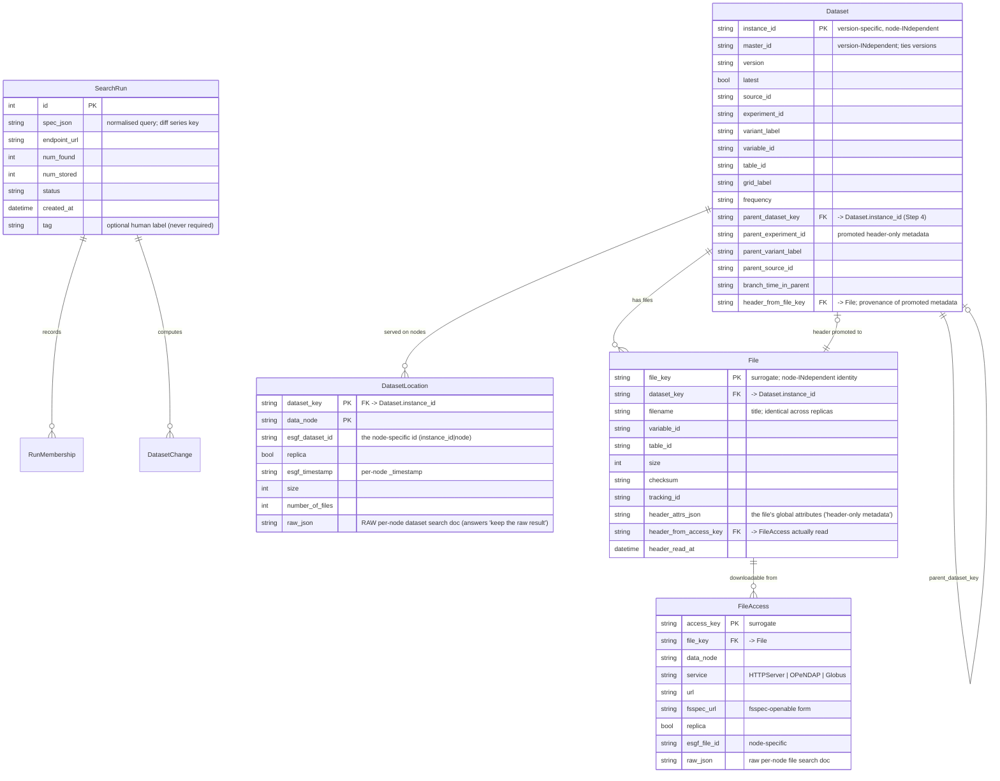
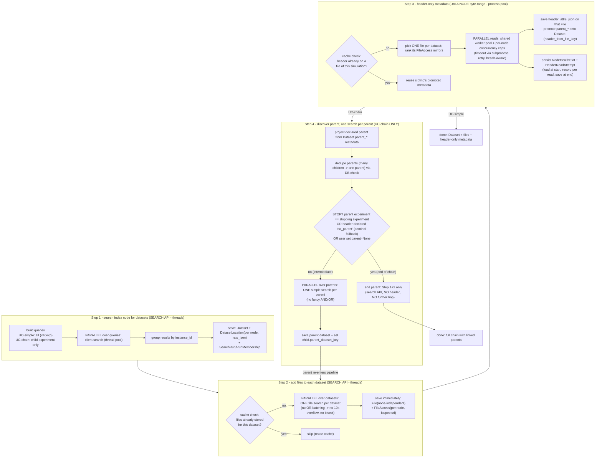

# Search / dataset / file / header workflow (CMIP6)

Status: **living document** — decisions D1-D5 confirmed 2026-07-20. Scope: CMIP6
only, before any MIP-generation or ESGF1/ESGF-NG integration. **Keep this file and
its diagrams updated as the build proceeds** (any schema, step, or parallelism
change lands here in the same commit).

This document maps the end-to-end workflow shared by two use cases and the data
model behind it. The Mermaid sources below are plain text (diff-able in git);
GitHub renders them, or paste into <https://mermaid.live> to view.

## The two use cases

- **UC-simple** — e.g. `ssp245` `tas`. Search the index node, add files, read one
  header per dataset. Stops at Step 3.
- **UC-chain** — we know the **child** experiment and the **stopping parent**
  experiment, but *not* the intermediate hops. We only search the index node for
  the child at the start; every parent is discovered from a child's header, then
  searched for individually. Runs Steps 1-4 and loops.

They share Steps 1-3 exactly. They diverge at Step 4 (only UC-chain hops).

## Data model (reconciled)

Key change (agreed): the primary key becomes `instance_id`, so **datasets that
differ only by data node are the same dataset**. Everything node-specific moves to
child tables. This already diverges from ESGF's own model (where the dataset `id`
embeds the node) — a divergence we accept and will revisit for CMIP5/7 + ESGF-NG.

Notes on identity / grains:

- **`instance_id` = the dataset, minus the node.** A new *version* is a new
  `instance_id` (a separate dataset row); `master_id` threads versions together.
- **`DatasetLocation`** is *dataset-search provenance*: it holds the raw per-node
  dataset doc and per-node dataset facts (`_timestamp`, `replica`), written at
  Step 1 from the `distrib` search. This is where the raw JSON lives.
- **`File`** is node-independent (one row per logical file). **`FileAccess`** is the
  per-node "where can I actually download it" table (fsspec links) — written at
  Step 2. Node availability therefore exists at two grains that are populated at
  two different steps (dataset-grain at Step 1, file-grain at Step 2); both are
  real and neither is derived from the other.
- The old `DatasetHeader` (simulation-grain) is **retired**: a header physically
  belongs to a *file*, so it is stored on `File`; the dataset-applicable subset
  (parent metadata, etc.) is *promoted* onto `Dataset` with a `header_from_file_key`
  pointer so we always know which file it came from.
- `HeaderReadAttempt` and `NodeHealthStat` are unchanged (diagnostics + health).

## Workflow

### The parent loop (UC-chain)

A discovered *intermediate* parent re-enters at **Step 2** (add its files) → Step 3
(read its header, to find *its* parent) → Step 4 (hop again). A discovered parent
whose experiment is the **stopping** experiment is the end of chain: it gets Step 1
(it was just searched) + Step 2 (files, so the data is reachable) but **no Step 3
header read** and **no Step 4** — we never need the final parent's own parent. A
global visited/DB check means a parent shared by many children is searched once.

**Stop condition (three ways, robust to user error):** the walk stops when
(a) a discovered parent's `experiment_id` equals the user-declared **stopping
experiment**; or (b) as a **fallback**, a header declares the CMIP6 `"no parent"`
sentinel — so a typo in the stopping experiment, or `parent=None`, still terminates
cleanly at the true top of the tree instead of chasing a non-existent parent; or
(c) the user explicitly passed `parent=None` (walk to whatever the headers say is
the top). The sentinel fallback (b) is always active regardless of (a).

## Per-step function-call map (current -> target)

| Step | Today | Target change | Parallelism |
|---|---|---|---|
| 1 search | `client.search_many`, `runner.fetch_records/_dedupe`, `repository.record_run/_upsert_dataset` | group by `instance_id`; write `DatasetLocation` (raw per-node); `SearchRun` keyed on spec, `use_case` gone | thread pool over queries (exists via `map_fn`; scripts must pass `thread_pool_map` — default is `serial_map`) |
| 2 files | `enrich_headers._lookup_files` **ORs many `dataset_id`s per request**, `_chunk_ids`, `_search_files_for_ids` bisect | **one `search_files` per dataset**, run through an explicit parallel `MapFn`; save `File` + `FileAccess` immediately; drop the char-budget/bisect machinery | thread pool over datasets (NEW explicit; today it is batched, not per-dataset) |
| 3 header | `enrich_headers` → `dispatch_reads` → `read_header`; stored in `DatasetHeader` | store on `File`; promote subset to `Dataset`; rename concept to "header-only metadata" | thread pool of workers, per-read subprocess for timeout, per-node concurrency caps (EXISTS — keep) |
| 4 parent | `parent_hop.declared_parent`, `_locate_missing` **`search_many([...])` batch** | **one simple search per parent**, DB dedupe check, set `parent_dataset_key`; end-of-chain skips header | thread pool over parents (NEW explicit; today batched) |

## Answers to the specific questions raised

1. **Where does the raw dataset JSON go?** On `DatasetLocation.raw_json`, one row per
   `(instance_id, data_node)`. Because `instance_id` collapses nodes but each node
   returned a *distinct* raw doc, the raw docs are inherently per-node; keeping them
   here means the exact search result is never lost even though the `Dataset` row is
   node-independent.
2. **Can the search API be hit with threads?** Yes — search is HTTP I/O, so a thread
   pool is correct and already the mechanism (`httpx_fetch` + `thread_pool_map`).
   Header reads are the exception: netCDF is not thread-safe and a stalled read must
   be killed, so those run on a worker pool with a **subprocess per read** (a process
   boundary), never a plain thread.
3. **Is parallelism already there?** Step 1: yes, but off by default (`serial_map`);
   callers opt in with `thread_pool_map`. Step 3: yes (the dispatcher). Steps 2 and 4:
   **no** — today they are *batched* (many datasets/parents folded into one request),
   which is exactly what we are replacing with one-search-per-dataset + explicit
   client-side parallelism.
4. **"Header" is the wrong word for a dataset.** Agreed. Files have headers; datasets
   do not. Language: a **file** stores its `header_attrs_json`; the **dataset** carries
   promoted **"header-only metadata"** (a.k.a. header-only dataset metadata) with a
   pointer to the file it came from.

## Decisions (confirmed 2026-07-20)

- **D1 ✅** `DatasetLocation` is the home for raw per-node dataset docs and per-node
  dataset facts (written at Step 1).
- **D2 ✅** `File` uses a surrogate key with a natural unique index on
  `(dataset_key, filename)`; `tracking_id` is stored but not the identity.
- **D3 ✅** `DatasetHeader` (simulation-grain) is retired in favour of
  `File.header_attrs_json` + promoted `Dataset` columns, preserving the
  cross-variable reuse optimisation by copying a sibling dataset's promoted metadata.
- **D4 ✅** End-of-chain parent gets Step 1 **+ Step 2 (files)** so its data is
  reachable, but **no header read** and no further hop.
- **D5 ✅** Stop condition = user-declared stopping experiment, **with** the
  `"no parent"` header sentinel always active as a fallback (robust to a typo or
  `parent=None`). See "Stop condition" above.

## Node health & attempt logging (must persist — do not lose)

The per-node health learning and the append-only attempt log are **first-class and
must keep persisting** across the restructure. They live in Step 3 (the only step
that contacts data nodes):

- `Repository.load_node_health()` at the start of a read pass, `recording(...)` onto
  the in-memory `NodeHealth` per read, `save_node_health()` at the end
  (`persist_health=True`).
- Every attempt (including retries and fully-failed simulations) is written to
  `HeaderReadAttempt` via `record_header_attempts()`.
- `NodeHealthStat` and `HeaderReadAttempt` tables are **unchanged** by this work.

Steps 1, 2 and 4 hit the *search index*, not data nodes, so they do not produce node
health — health is a Step 3 concept only.

## Testing & observability (visual, per step)

Requirement: at each step it must be possible to see **exactly which functions run,
with their inputs and outputs, and where parallelism happens**. Plan:

- Each step is exercised by a focused test that asserts the *call sequence* (via a
  recording double / spy over the injected seams: `Fetch`, `MapFn`, `HeaderReader`,
  `Repository`), so the test doubles as living documentation of the step's contract.
- Inputs/outputs are the small dataclasses already in play (`FacetQuery`,
  `DatasetRecord`, `FileRecord`, `EnrichResult`, …) — each step's test shows the
  concrete in → out for a tiny fixture.
- Parallelism is an *injected* `MapFn`, so a test can pass a recording `serial_map`
  to capture "these N queries were mapped here" and prove one-search-per-dataset
  (Steps 2 & 4) without real threads.
- A short `__main__`-guarded script per step (under `scripts/`) prints the same call
  trace on a tiny live fixture, for a runnable visual of the flow.
