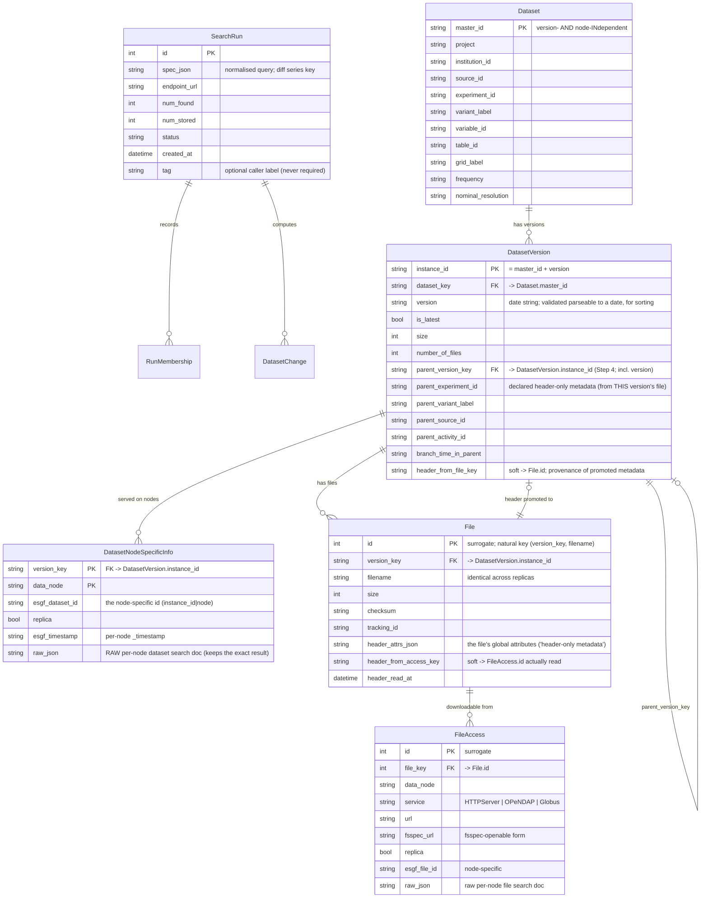
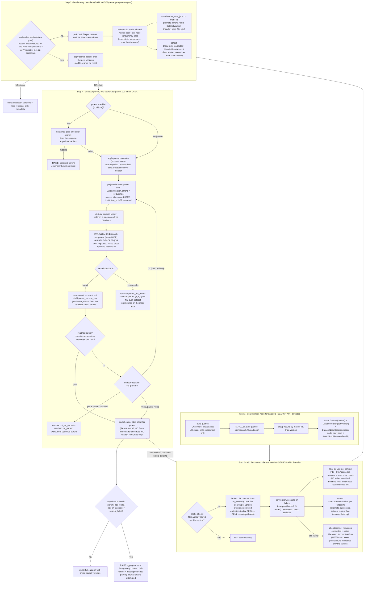

# Search / dataset / file / header workflow (CMIP6)

Status: **living document** — decisions D1-D8 confirmed 2026-07. Scope: CMIP6
only, before any MIP-generation or ESGF1/ESGF-NG integration. **Keep this file and
its diagrams updated as the build proceeds** (any schema, step, or parallelism
change lands here in the same commit).

This document maps the end-to-end workflow shared by two use cases and the data
model behind it. The Mermaid sources below are plain text (diff-able in git);
GitHub renders them, or paste into <https://mermaid.live> to view.

## The two use cases

- **UC-simple** — e.g. `ssp245` `tas`. No parent, so **Step 1 only**: search the index
  node for the datasets and stop. There is no parent lineage to resolve, so no header
  is needed — and files/headers exist only to serve that resolution (see below).
- **UC-chain** — we know the **child** experiment and the **stopping parent**
  experiment, but *not* the intermediate hops. We only search the index node for
  the child at the start; every parent is discovered from a child's header, then
  searched for individually. Runs Steps 1-4 and loops.

**Files are only the substrate for a header read.** Header-only metadata (the
`parent_*` lineage) is **independent of variable**, so one header per simulation
`(source_id, experiment_id, variant_label)` serves every variable, read from **one**
file. Steps 2-3 therefore run *only* for the parent-walk use case: a simulation whose
header is already known (from any variable, including an earlier run) is copied over,
skipping both its file search and its read. So UC-simple stops at Step 1; UC-chain runs
Steps 1-4 (files/header for lineage only) and loops.

## Data model (reconciled)

Key change (agreed): the version-invariant primary key is `master_id`, so a
**dataset** is one logical thing and its **versions** live in a child table
`DatasetVersion`. Everything that varies by version — files, node availability,
header-only metadata and the parent link — hangs off the *version*, not the dataset.
This is the same "collapse the duplicated dimension into a child table" move we made
for data nodes, now applied to versions. It diverges from ESGF's own model (where a
dataset `id` embeds *both* version and node) — a divergence we accept and will
revisit for CMIP5/7 + ESGF-NG.

Notes on identity / grains:

- **`Dataset` (`master_id`) is the version-invariant anchor.** It holds only facets
  that never change between versions (source, experiment, variant, variable, table,
  grid, …). `master_id` already encodes all of these — it is the ESGF `instance_id`
  *minus* the trailing version — so nothing on `Dataset` is duplicated across
  versions.
- **`DatasetVersion` (`instance_id`) is one row per published version.** Everything
  version-specific lives here: the `version` string, `is_latest`, size/file counts,
  the **parent link** (`parent_version_key`, pointing at the parent's *specific
  version*), and the **promoted header-only metadata** — because a header is read
  from a *version's* file, its declared `parent_*` is a property of the version, not
  of the version-invariant dataset. `version` is validated as parseable to a date
  (CMIP6 versions are `vYYYYMMDD`) so versions sort chronologically; the current one
  is flagged `is_latest`.
- **`DatasetNodeSpecificInfo`** now hangs off the *version* (`version_key`): a data node
  serves a specific version. It holds the raw per-node dataset doc and per-node facts
  (`_timestamp`, `replica`), written at Step 1. This is where the raw JSON lives.
- **`File`** (node-independent) and **`FileAccess`** (per-node fsspec URLs) hang off
  the version too, since files and checksums are version-specific. Node availability
  exists at two grains — version (`DatasetNodeSpecificInfo`, Step 1) and file (`FileAccess`,
  Step 2) — populated at different steps; both real, neither derived from the other.
- The old `DatasetHeader` (simulation-grain) has been **retired**: the header now
  goes on `File.header_attrs_json`, and the dataset-applicable subset is *promoted*
  onto the `DatasetVersion` with a `header_from_file_key` pointer so we always know
  which file it came from. The header-on-file path (`enrich_version_headers`, Step 3)
  and the new parent walk (`resolve_parent_chains`, Step 4) are the only header code
  paths; the old `search/headers.py` (`enrich_headers`) and `search/parent_hop.py`
  (`enrich_with_parents`/`enrich_parent_chains`) modules and the `DatasetHeader` table
  are deleted, and the live scripts are rewired onto the new path. `declared_parent`
  (the `parent_*` → parent-simulation projection) now lives in `search/parent_walk.py`.
- `HeaderReadAttempt` and `DataNodeHealthStat` are unchanged (data-node diagnostics +
  health). Two new twins cover the *search index* endpoints hit in Step 2:
  `IndexNodeHealthStat` mirrors `DataNodeHealthStat` (per-endpoint aggregates), and
  `FileAccessAttempt` mirrors `HeaderReadAttempt` (an append-only per-search-call log —
  every retry, requeue and fallback, with an `empty` outcome recorded distinctly from a
  `success`). See "Node health & attempt logging" below.
- `RunMembership`/`DatasetChange` record which **versions** (`instance_id`) a run
  returned, so a new version appears as an `added` (and the superseded one as
  `removed`) — surfacing version changes between two searches of the same spec.

### Soft (non-enforced) pointers — why two links are not FKs

Two provenance links are stored as **indexed plain columns, not foreign keys**:
`DatasetVersion.header_from_file_key` (-> `File.id`) and `File.header_from_access_key`
(-> `FileAccess.id`).

- **Why not enforce them?** They would form insert-time cycles — `DatasetVersion`
  needs a `File` that needs its `DatasetVersion`; `File` needs a `FileAccess` that
  needs its `File`. A real FK either deadlocks the insert or needs SQLAlchemy
  `post_update` (insert-then-patch) machinery and awkward cascade ordering.
- **Why it is safe.** They are provenance ("where this metadata was read from"), not
  load-bearing for correctness; every write goes through the `Repository`, which
  keeps them consistent. The promoted metadata can legitimately point at a **sibling
  version's** file (the cross-variable header-reuse optimisation), which a
  per-version FK could not model anyway.
- **Future risk / mitigation.** The only downside is a possible dangling pointer if a
  `File`/`FileAccess` is deleted; because writes are centralised we re-point or clear
  it in the same operation. On PostgreSQL these could later become *deferrable* real
  FKs if we ever want the database-level guarantee. `parent_version_key` (child
  version -> parent version) stays a real self-referential FK on `DatasetVersion`
  (adjacency list, no cycle).

Validated on landing (D6 rework): all 11 tables build, mappers configure, the
`master -> version -> {location, file -> access}` hierarchy round-trips, the child
version -> parent version link resolves, a non-date version is rejected, a **no-parent**
simple use case works with parent/header columns `NULL`, and deleting a `Dataset`
(master) cascades to its versions, locations, files and file accesses. Full suite green
(mypy strict + ruff + doctests, ~96% coverage).

## Workflow

### Version handling — store all versions, select a target for Steps 2-3

Step 1 fetches **all** published versions of each dataset: the index query omits the
`latest` parameter (`FacetQuery.latest` defaults to `None`), so `DatasetVersion` holds
the full version history. ESGF's `latest` flag is still recorded on `is_latest` but is
**not trusted** — data nodes disagree about it (a superseded and a newer version can
each be flagged `latest=true` by different nodes).

Between Step 1 and Step 2, `search/versions.py::select_target_versions` narrows to a
**target version per dataset**, and only those versions get files (Step 2) and headers
(Step 3). The default is the **true latest by version date** (`parse_version_date`, not
a string sort, so a stray `v` prefix cannot mis-rank). The `selection` seam accepts
`"latest"` (default), `"all"` (every version), or a `{master_id: version}` mapping that
pins specific datasets to a chosen (e.g. older) version — the "user asks for a specific
version" case. A dataset with no date-parseable version is kept in full, never dropped.

### The parent loop (UC-chain)

A discovered *intermediate* parent re-enters at **Step 2** (add its files) → Step 3
(read its header, to find *its* parent) → Step 4 (hop again). The chain's final
parent gets Step 1 (it was just searched) + Step 2 (files, so its data is reachable)
but **no Step 3 header read** and **no Step 4** — we never need the final parent's
own parent. A global visited/DB check means a parent shared by many children is
searched once.

**Stop condition — errors, not warnings.** There are two validation gates and no
soft warnings:

1. **Existence gate (only when the user specified a parent, i.e. not `None`).**
   Before walking, do one quick index-node search to confirm the specified stopping
   experiment *exists at all*. If it does not (e.g. a typo like `picontrole`),
   **raise immediately** — no walk.
2. **The walk.**
   - **`parent=None`** — walk up, following each header's declared parent, and stop
     when a header declares the CMIP6 `"no parent"` sentinel (the true top). No
     error; this is the deliberate "go all the way up" case.
   - **parent specified** — walk up until a discovered parent's `experiment_id`
     equals the specified stopping experiment → **stop (success)**. If instead the
     walk reaches `"no parent"` *without ever passing through* the specified
     experiment (e.g. start `G6solar`, specified parent `ssp119`: both exist in ESGF,
     but `ssp119` is not on `G6solar`'s chain), **raise** — the specified parent is
     real but is not an ancestor of the child.

`max_hops` remains a safety net against a metadata cycle (also raising if hit).

### Declared parent not found, overrides, and institution

**"Parent not found" means the *index* has zero results** for the declared
`(source_id, experiment_id, variant_label)` — the metadata points at a dataset that
was never published (or was withdrawn). This is **distinct** from "the dataset is
indexed but every data node serving it is down" (a Step-3 data-availability / dead-node
concern, handled by node health) — the index knows a dataset exists regardless of
whether any node is currently up. To avoid false negatives:

- conclude "absent" only from a **successful** search returning zero — never from a
  timeout/HTTP error (that is a transient `search_failed`, retried, and if it persists
  raised as a *different* error);
- the search is **variable-scoped** — the declared `(source, experiment, variant)`
  constrained to the requested variables (an OR), latest-agnostic, replicas allowed.
  **Consequence (accepted):** a parent that exists but publishes *none* of the requested
  variables comes back empty and so is a `parent_not_found` — the walk cannot tell that
  apart from a parent that does not exist at all. (This reverses an earlier
  variable-agnostic existence design; the trade-off was made deliberately.) A parent
  that publishes *some but not all* of the requested variables resolves, with the absent
  ones recorded as `VariableGap`s (informational, not chain-breaking);
- **never silently relax the declared variant** — `branch_time_in_parent` is defined
  against that specific variant, so a different variant is a *different, wrong* parent.

When a declared parent is genuinely absent, the chain ends in a `parent_not_found`
terminal with the precise message, e.g. *"CanESM5 abrupt-4xCO2 r1i1p1f2 declares parent
(CanESM5, piControl, r1i1p1f9) but no such dataset is published on the index node — the
chain cannot be completed."* All chains are attempted, then an **aggregate error** is
raised listing every broken one (rather than aborting on the first). This applies to
`parent=None` walks too: a declared-but-missing ancestor is a broken chain, so it
raises — the override below is the escape hatch, not a silent warning.

**Override seam (built).** A user who knows a specific child→parent link is wrong in the
archive's global metadata can **override** it — either **up front** (supply corrections
before the walk) or **after** a `parent_not_found` error (add the correction and
re-run). The parent *projection* is a replaceable input: the injected `parent_overrides`
mapping (child simulation → corrected parent simulation) **takes precedence over the
header** when present (`resolve_parent_chains(..., parent_overrides=...)`, surfaced as an
editable `PARENT_OVERRIDES` in the uc2/g6solar scripts). A future **known-fixes library**
(curated overrides for known-bad CMIP6 metadata) would simply produce such a mapping for
a user to opt into.

**Institution is never assumed between parent and child.** `source_id` must match (the
parent of a CMIP6 run is the same model, so a missing `parent_source_id` defaults to the
child's), but **`institution_id` can differ** and is **not** assumed. CMIP6 headers do
not even carry a `parent_institution_id`, so the parent's institution is *unknowable*
from the child — which means we **cannot string-construct the parent's `master_id` /
`instance_id`** from the child (institution *and* version are unknown). The parent's
`institution_id` is read from the **parent's own search result** and stored on the
parent's `Dataset` (master) row. This is a design rule to enforce (with a test) when
Step 4 is built; nothing in the code assumes institution today.

## Per-step function-call map (current -> target)

| Step | Today | Target change | Parallelism |
|---|---|---|---|
| 1 search | `client.search_many`, `runner.fetch_records/_dedupe`, `repository.record_run` | **DONE (Increment A/B + D6 rework):** group `master_id -> version -> node`; write `Dataset` (master) + `DatasetVersion` + `DatasetNodeSpecificInfo`; version string validated date-parseable; `SearchRun` keyed on spec, `use_case` gone (optional `tag`); membership/diff at version grain; `get_dataset_records(tag)` reconstructs per-node records | thread pool over queries (exists via `map_fn`; scripts must pass `thread_pool_map` — default is `serial_map`) |
| 2 files | `enrich_headers._lookup_files` **ORs many `dataset_id`s per request**, `_chunk_ids`, `_search_files_for_ids` bisect | **DONE (Increment C + endpoint-fallback rework):** `search/files.py::add_files` does **one `search_files` per version** through an injected `MapFn`, over a **preference-ordered list of endpoints** (`build_file_search_clients`; today CEDA → ORNL → metagrid-west while west is in maintenance). Per version it escalates on failure — **in-request exponential backoff (default 5 retries) → requeue → fall back to the next endpoint** — and a worker **never raises** (one 500 no longer aborts the pass). **Save-as-you-go**: each version's `File` + `FileAccess` (fsspec URLs, http→https) is committed via `repository.store_files` the instant its search succeeds, DB writes serialised behind a lock (SQLite single-writer; WAL on); `version_has_files` is the cache check. Records `IndexNodeHealthStat` per endpoint and logs every search call (retry/requeue/fallback, `empty` distinct from `success`) to `FileAccessAttempt`; raises `FileSearchIncompleteError` (listing the unresolved versions) only after every endpoint/requeue is exhausted **and** successes are persisted, so a re-run retries just the failures. (The old batched `_lookup_files` was deleted with the rest of the old header path.) | thread pool over versions (`n_workers` via `thread_pool_map`); DB writes serialised |
| 3 header | `enrich_headers` → `dispatch_reads` → `read_header`; stored in `DatasetHeader` | **DONE (Increment D):** `search/version_headers.py::enrich_version_headers` reads one header per **simulation** from the persisted `FileAccess`, stores it on `File.header_attrs_json`, and promotes the `parent_*` subset onto **every `DatasetVersion`** of the sim (`header_from_file_key`); reuses the existing `dispatch_reads`/health/attempt-log/retry (health **persists**). (The old `enrich_headers`/`DatasetHeader` have been deleted.) | reuses the dispatcher: thread-pool workers, per-read subprocess timeout, per-node concurrency caps |
| 4 parent | `parent_hop.declared_parent`, `_locate_missing` **`search_many([...])` batch** | **DONE (Increment E):** `search/parent_walk.py::resolve_parent_chains` walks hop-by-hop, reading headers via `enrich_version_headers`, issuing **one search per distinct parent** through the injected `MapFn`, storing found parents and setting `parent_version_key` (child version → same-variable parent version). Existence gate, `ParentNotFound`, `ParentNotAncestor` all **raise** (aggregated); `parent_overrides` seam; institution never assumed; end-of-chain skips the header. Routing controls (`preferred_hosts`, `ignore_hosts`, `timeout`, `node_concurrency`, `max_workers`, `skip_cached`) are threaded through each hop's `enrich_version_headers`. Old `parent_hop`/`enrich_headers`/`DatasetHeader` deleted; the uc2/g6solar scripts are rewired onto `resolve_parent_chains`. | one search per parent through the `MapFn` (pass `thread_pool_map`) |

## Answers to the specific questions raised

1. **Where does the raw dataset JSON go?** On `DatasetNodeSpecificInfo.raw_json`, one row per
   `(version, data_node)` (the location hangs off `DatasetVersion`). Each node
   returned a *distinct* raw doc, so the raw docs are inherently per-node; keeping
   them here means the exact search result is never lost even though `Dataset`
   (`master_id`) and `DatasetVersion` are node-independent.
2. **Can the search API be hit with threads?** Yes — search is HTTP I/O, so a thread
   pool is correct and already the mechanism (`httpx_fetch` + `thread_pool_map`).
   Header reads are the exception: netCDF is not thread-safe and a stalled read must
   be killed, so those run on a worker pool with a **subprocess per read** (a process
   boundary), never a plain thread.
3. **Is parallelism already there?** Step 1: yes, but off by default (`serial_map`);
   callers opt in with `thread_pool_map`. Step 2: **yes** — one search per version fanned
   out over `n_workers`, with per-version backoff → requeue → endpoint fallback and
   save-as-you-go (the old batching is gone). Step 3: yes (the dispatcher). Step 4:
   **still batched** for the parent search (one search per parent is the intent), but it
   re-uses Step 2's parallel file search per hop.
4. **"Header" is the wrong word for a dataset.** Agreed. Files have headers; datasets
   do not. Language: a **file** stores its `header_attrs_json`; the **dataset** carries
   promoted **"header-only metadata"** (a.k.a. header-only dataset metadata) with a
   pointer to the file it came from.

## Decisions (confirmed 2026-07-20)

- **D1 ✅** `DatasetNodeSpecificInfo` is the home for raw per-node dataset docs and per-node
  dataset facts (written at Step 1).
- **D2 ✅** `File` uses a surrogate key with a natural unique index on
  `(dataset_key, filename)`; `tracking_id` is stored but not the identity.
- **D3 ✅** `DatasetHeader` (simulation-grain) is retired in favour of
  `File.header_attrs_json` + promoted **`DatasetVersion`** columns, preserving the
  cross-variable reuse optimisation by copying a sibling version's promoted metadata.
- **D4 ✅ (revised)** End-of-chain parent gets **Step 1 only** — it is stored by the
  search, but gets **no files** (files are only the substrate for a header read, and a
  terminal needs no header), **no header read** and no further hop. (Supersedes the
  earlier "Step 1 + Step 2 files"; files are no longer a per-dataset deliverable.)
- **D5 ✅** Stop condition raises **errors, not warnings**: an *existence gate*
  (raise if a user-specified stopping experiment does not exist on the index node)
  and a *not-an-ancestor* check (raise if the walk hits `"no parent"` without passing
  through the specified experiment). `parent=None` walks to the `"no parent"` sentinel
  with no error. See "Stop condition" above.
- **D6 ✅** Versions get their own grain: `Dataset` is keyed on **`master_id`** (one
  row per logical dataset, version-invariant facets only); a new **`DatasetVersion`**
  child (`instance_id`) holds the `version` (validated date-parseable, for sorting),
  `is_latest`, counts, the **parent link** (`parent_version_key` -> another
  `DatasetVersion`) and the promoted header-only metadata. `DatasetNodeSpecificInfo`, `File`
  and `FileAccess` all hang off the **version**. This revises the Increment A/B PK
  (`instance_id` -> `master_id`).
- **D7 ✅** A declared parent with **zero index results** is `parent_not_found` and
  **raises** (distinct from indexed-but-dead-nodes). Detection: successful-zero only
  (transient errors are `search_failed`, retried), broad search, declared variant
  never relaxed. All chains are attempted, then an **aggregate** error lists every
  broken one. A **`parent_overrides`** seam (user-supplied up front or after the
  error, and a future known-fixes library) can correct a wrong child→parent link and
  takes precedence over the header — design room now, not built.
- **D8 ✅** In parent/child resolution, **`source_id` must match** (missing
  `parent_source_id` defaults to the child's) but **`institution_id` is never
  assumed** — CMIP6 headers carry no `parent_institution_id`, so the parent's
  institution (and version) are discovered by search, not constructed from the child.
  Enforce with a test when Step 4 is built.

## Node health & attempt logging (must persist — do not lose)

There are **two independent health stores**, each owned by the step that talks to that
kind of server: *data-node* health (Step 3, header reads) and *index-node* health
(Step 2, file searches).

**Data-node health (Step 3 — the only step that contacts data nodes).** The per-node
health learning and the append-only attempt log are **first-class and must keep
persisting** across the restructure:

- `Repository.load_node_health()` at the start of a read pass, `recording(...)` onto
  the in-memory `NodeHealth` per read, `save_node_health()` at the end
  (`persist_health=True`).
- Every attempt (including retries and fully-failed simulations) is written to
  `HeaderReadAttempt` via `record_header_attempts()`.
- `DataNodeHealthStat` and `HeaderReadAttempt` tables are **unchanged** by this work.

**Index-node health (Step 2 — the file search).** The Step-2 twin: `search/files.py::
add_files` records each per-endpoint search call into an in-memory `IndexNodeHealth`
(`esgf/index_health.py`) and persists it to `IndexNodeHealthStat` via
`Repository.save_index_health()` (loaded with `load_index_health()`, flushed **as the
run proceeds**, not only at the end). It tracks per endpoint: attempts, successes,
failures, **retries**, **server_errors** (HTTP 5xx — e.g. the metagrid-west 500s) and
**timeouts**, plus latency. Endpoint *ordering* stays the caller's explicit preference;
health is recorded for observability and future ranking
(`rank_index_nodes_by_reliability`), not to reorder the preference.

Alongside those aggregates, **every individual search call** is written to the
append-only `FileAccessAttempt` log via `Repository.record_file_access_attempts()` (the
Step-2 twin of `record_header_attempts`): one row per call — each backoff retry, each
requeue and each endpoint fallback — carrying the `endpoint`, `version_key`, `outcome`,
`files_found`, latency and `attempt_no`. Crucially it records an **`empty`** outcome
(HTTP 200 with zero files) distinctly from a `success` with files, so the versions behind
Step 3's `no_files` become directly queryable (`get_file_access_attempts(outcome="empty")`).
It saves as the run proceeds, under the same write lock as `store_files`.

Step 1 also hits the search index but keeps its own single-endpoint retry and records no
index-node health; Step 4 re-uses Step 2 per hop (so its file searches feed the same
`IndexNodeHealthStat` and `FileAccessAttempt`).

## Testing & observability (visual, per step)

Requirement: at each step it must be possible to see **exactly which functions run,
with their inputs and outputs, and where parallelism happens**. Plan:

- Each step is exercised by a focused test that asserts the *call sequence* (via a
  recording double / spy over the injected seams: `Fetch`, `MapFn`, `HeaderReader`,
  `Repository`), so the test doubles as living documentation of the step's contract.
- Inputs/outputs are the small dataclasses already in play (`FacetQuery`,
  `DatasetRecord`, `FileRecord`, `EnrichResult`, …) — each step's test shows the
  concrete in → out for a tiny fixture.
- Parallelism is an *injected* `MapFn`, so a test can pass a recording `serial_map`
  to capture "these N queries were mapped here" and prove one-search-per-dataset
  (Steps 2 & 4) without real threads.
- A short `__main__`-guarded script per step (under `scripts/`) prints the same call
  trace on a tiny live fixture, for a runnable visual of the flow.
