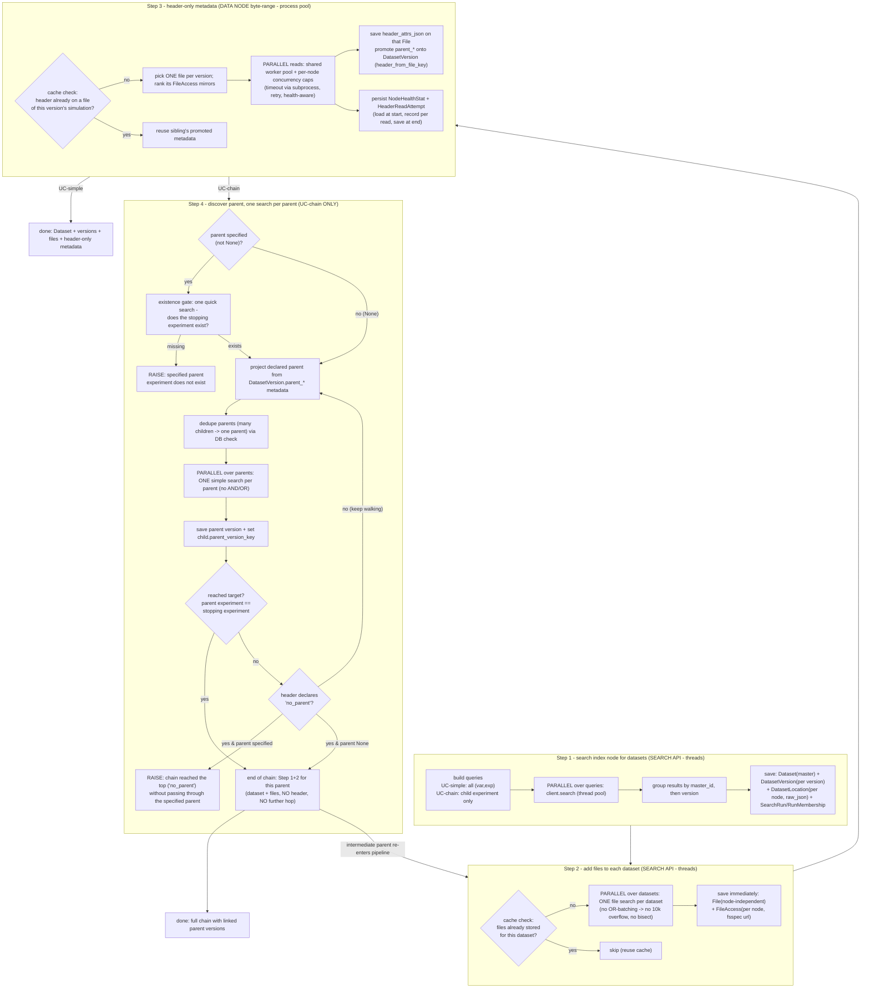

# Search / dataset / file / header workflow (CMIP6)

Status: **living document** — decisions D1-D6 confirmed 2026-07-20. Scope: CMIP6
only, before any MIP-generation or ESGF1/ESGF-NG integration. **Keep this file and
its diagrams updated as the build proceeds** (any schema, step, or parallelism
change lands here in the same commit).

This document maps the end-to-end workflow shared by two use cases and the data
model behind it. The Mermaid sources below are plain text (diff-able in git);
GitHub renders them, or paste into <https://mermaid.live> to view.

## The two use cases

- **UC-simple** — e.g. `ssp245` `tas`. Search the index node, add files, read one
  header per dataset. Stops at Step 3.
- **UC-chain** — we know the **child** experiment and the **stopping parent**
  experiment, but *not* the intermediate hops. We only search the index node for
  the child at the start; every parent is discovered from a child's header, then
  searched for individually. Runs Steps 1-4 and loops.

They share Steps 1-3 exactly. They diverge at Step 4 (only UC-chain hops).

## Data model (reconciled)

Key change (agreed): the version-invariant primary key is `master_id`, so a
**dataset** is one logical thing and its **versions** live in a child table
`DatasetVersion`. Everything that varies by version — files, node availability,
header-only metadata and the parent link — hangs off the *version*, not the dataset.
This is the same "collapse the duplicated dimension into a child table" move we made
for data nodes, now applied to versions. It diverges from ESGF's own model (where a
dataset `id` embeds *both* version and node) — a divergence we accept and will
revisit for CMIP5/7 + ESGF-NG.

Notes on identity / grains:

- **`Dataset` (`master_id`) is the version-invariant anchor.** It holds only facets
  that never change between versions (source, experiment, variant, variable, table,
  grid, …). `master_id` already encodes all of these — it is the ESGF `instance_id`
  *minus* the trailing version — so nothing on `Dataset` is duplicated across
  versions.
- **`DatasetVersion` (`instance_id`) is one row per published version.** Everything
  version-specific lives here: the `version` string, `is_latest`, size/file counts,
  the **parent link** (`parent_version_key`, pointing at the parent's *specific
  version*), and the **promoted header-only metadata** — because a header is read
  from a *version's* file, its declared `parent_*` is a property of the version, not
  of the version-invariant dataset. `version` is validated as parseable to a date
  (CMIP6 versions are `vYYYYMMDD`) so versions sort chronologically; the current one
  is flagged `is_latest`.
- **`DatasetLocation`** now hangs off the *version* (`version_key`): a data node
  serves a specific version. It holds the raw per-node dataset doc and per-node facts
  (`_timestamp`, `replica`), written at Step 1. This is where the raw JSON lives.
- **`File`** (node-independent) and **`FileAccess`** (per-node fsspec URLs) hang off
  the version too, since files and checksums are version-specific. Node availability
  exists at two grains — version (`DatasetLocation`, Step 1) and file (`FileAccess`,
  Step 2) — populated at different steps; both real, neither derived from the other.
- The old `DatasetHeader` (simulation-grain) is being **retired**: the header goes on
  `File.header_attrs_json`, and the dataset-applicable subset is *promoted* onto the
  `DatasetVersion` with a `header_from_file_key` pointer so we always know which file
  it came from. **Transitional:** `DatasetHeader` is still present and backs the
  not-yet-migrated header pipeline; it is deleted at the end of Increment D. This
  keeps every increment green (no test skips, no coverage cliff).
- `HeaderReadAttempt` and `NodeHealthStat` are unchanged (diagnostics + health).
- `RunMembership`/`DatasetChange` record which **versions** (`instance_id`) a run
  returned, so a new version appears as an `added` (and the superseded one as
  `removed`) — surfacing version changes between two searches of the same spec.

### Soft (non-enforced) pointers — why two links are not FKs

Two provenance links are stored as **indexed plain columns, not foreign keys**:
`DatasetVersion.header_from_file_key` (-> `File.id`) and `File.header_from_access_key`
(-> `FileAccess.id`).

- **Why not enforce them?** They would form insert-time cycles — `DatasetVersion`
  needs a `File` that needs its `DatasetVersion`; `File` needs a `FileAccess` that
  needs its `File`. A real FK either deadlocks the insert or needs SQLAlchemy
  `post_update` (insert-then-patch) machinery and awkward cascade ordering.
- **Why it is safe.** They are provenance ("where this metadata was read from"), not
  load-bearing for correctness; every write goes through the `Repository`, which
  keeps them consistent. The promoted metadata can legitimately point at a **sibling
  version's** file (the cross-variable header-reuse optimisation), which a
  per-version FK could not model anyway.
- **Future risk / mitigation.** The only downside is a possible dangling pointer if a
  `File`/`FileAccess` is deleted; because writes are centralised we re-point or clear
  it in the same operation. On PostgreSQL these could later become *deferrable* real
  FKs if we ever want the database-level guarantee. `parent_version_key` (child
  version -> parent version) stays a real self-referential FK on `DatasetVersion`
  (adjacency list, no cycle).

## Workflow

### The parent loop (UC-chain)

A discovered *intermediate* parent re-enters at **Step 2** (add its files) → Step 3
(read its header, to find *its* parent) → Step 4 (hop again). The chain's final
parent gets Step 1 (it was just searched) + Step 2 (files, so its data is reachable)
but **no Step 3 header read** and **no Step 4** — we never need the final parent's
own parent. A global visited/DB check means a parent shared by many children is
searched once.

**Stop condition — errors, not warnings.** There are two validation gates and no
soft warnings:

1. **Existence gate (only when the user specified a parent, i.e. not `None`).**
   Before walking, do one quick index-node search to confirm the specified stopping
   experiment *exists at all*. If it does not (e.g. a typo like `picontrole`),
   **raise immediately** — no walk.
2. **The walk.**
   - **`parent=None`** — walk up, following each header's declared parent, and stop
     when a header declares the CMIP6 `"no parent"` sentinel (the true top). No
     error; this is the deliberate "go all the way up" case.
   - **parent specified** — walk up until a discovered parent's `experiment_id`
     equals the specified stopping experiment → **stop (success)**. If instead the
     walk reaches `"no parent"` *without ever passing through* the specified
     experiment (e.g. start `G6solar`, specified parent `ssp119`: both exist in ESGF,
     but `ssp119` is not on `G6solar`'s chain), **raise** — the specified parent is
     real but is not an ancestor of the child.

`max_hops` remains a safety net against a metadata cycle (also raising if hit).

## Per-step function-call map (current -> target)

| Step | Today | Target change | Parallelism |
|---|---|---|---|
| 1 search | `client.search_many`, `runner.fetch_records/_dedupe`, `repository.record_run/_upsert_dataset` | **Increment B done at `instance_id` grain; being REVISED to `master_id`+`DatasetVersion`:** group by `master_id` then version; write `Dataset` + `DatasetVersion` + `DatasetLocation`; `SearchRun` keyed on spec, `use_case` gone (optional `tag`); membership/diff at version grain | thread pool over queries (exists via `map_fn`; scripts must pass `thread_pool_map` — default is `serial_map`) |
| 2 files | `enrich_headers._lookup_files` **ORs many `dataset_id`s per request**, `_chunk_ids`, `_search_files_for_ids` bisect | **one `search_files` per dataset**, run through an explicit parallel `MapFn`; save `File` + `FileAccess` immediately; drop the char-budget/bisect machinery | thread pool over datasets (NEW explicit; today it is batched, not per-dataset) |
| 3 header | `enrich_headers` → `dispatch_reads` → `read_header`; stored in `DatasetHeader` | store on `File`; promote subset to `Dataset`; rename concept to "header-only metadata" | thread pool of workers, per-read subprocess for timeout, per-node concurrency caps (EXISTS — keep) |
| 4 parent | `parent_hop.declared_parent`, `_locate_missing` **`search_many([...])` batch** | **one simple search per parent**, DB dedupe check, set `parent_version_key`; existence gate + "not an ancestor" both **raise**; end-of-chain skips header | thread pool over parents (NEW explicit; today batched) |

## Answers to the specific questions raised

1. **Where does the raw dataset JSON go?** On `DatasetLocation.raw_json`, one row per
   `(version, data_node)` (the location hangs off `DatasetVersion`). Each node
   returned a *distinct* raw doc, so the raw docs are inherently per-node; keeping
   them here means the exact search result is never lost even though `Dataset`
   (`master_id`) and `DatasetVersion` are node-independent.
2. **Can the search API be hit with threads?** Yes — search is HTTP I/O, so a thread
   pool is correct and already the mechanism (`httpx_fetch` + `thread_pool_map`).
   Header reads are the exception: netCDF is not thread-safe and a stalled read must
   be killed, so those run on a worker pool with a **subprocess per read** (a process
   boundary), never a plain thread.
3. **Is parallelism already there?** Step 1: yes, but off by default (`serial_map`);
   callers opt in with `thread_pool_map`. Step 3: yes (the dispatcher). Steps 2 and 4:
   **no** — today they are *batched* (many datasets/parents folded into one request),
   which is exactly what we are replacing with one-search-per-dataset + explicit
   client-side parallelism.
4. **"Header" is the wrong word for a dataset.** Agreed. Files have headers; datasets
   do not. Language: a **file** stores its `header_attrs_json`; the **dataset** carries
   promoted **"header-only metadata"** (a.k.a. header-only dataset metadata) with a
   pointer to the file it came from.

## Decisions (confirmed 2026-07-20)

- **D1 ✅** `DatasetLocation` is the home for raw per-node dataset docs and per-node
  dataset facts (written at Step 1).
- **D2 ✅** `File` uses a surrogate key with a natural unique index on
  `(dataset_key, filename)`; `tracking_id` is stored but not the identity.
- **D3 ✅** `DatasetHeader` (simulation-grain) is retired in favour of
  `File.header_attrs_json` + promoted **`DatasetVersion`** columns, preserving the
  cross-variable reuse optimisation by copying a sibling version's promoted metadata.
- **D4 ✅** End-of-chain parent gets Step 1 **+ Step 2 (files)** so its data is
  reachable, but **no header read** and no further hop.
- **D5 ✅** Stop condition raises **errors, not warnings**: an *existence gate*
  (raise if a user-specified stopping experiment does not exist on the index node)
  and a *not-an-ancestor* check (raise if the walk hits `"no parent"` without passing
  through the specified experiment). `parent=None` walks to the `"no parent"` sentinel
  with no error. See "Stop condition" above.
- **D6 ✅** Versions get their own grain: `Dataset` is keyed on **`master_id`** (one
  row per logical dataset, version-invariant facets only); a new **`DatasetVersion`**
  child (`instance_id`) holds the `version` (validated date-parseable, for sorting),
  `is_latest`, counts, the **parent link** (`parent_version_key` -> another
  `DatasetVersion`) and the promoted header-only metadata. `DatasetLocation`, `File`
  and `FileAccess` all hang off the **version**. This revises the Increment A/B PK
  (`instance_id` -> `master_id`).

## Node health & attempt logging (must persist — do not lose)

The per-node health learning and the append-only attempt log are **first-class and
must keep persisting** across the restructure. They live in Step 3 (the only step
that contacts data nodes):

- `Repository.load_node_health()` at the start of a read pass, `recording(...)` onto
  the in-memory `NodeHealth` per read, `save_node_health()` at the end
  (`persist_health=True`).
- Every attempt (including retries and fully-failed simulations) is written to
  `HeaderReadAttempt` via `record_header_attempts()`.
- `NodeHealthStat` and `HeaderReadAttempt` tables are **unchanged** by this work.

Steps 1, 2 and 4 hit the *search index*, not data nodes, so they do not produce node
health — health is a Step 3 concept only.

## Testing & observability (visual, per step)

Requirement: at each step it must be possible to see **exactly which functions run,
with their inputs and outputs, and where parallelism happens**. Plan:

- Each step is exercised by a focused test that asserts the *call sequence* (via a
  recording double / spy over the injected seams: `Fetch`, `MapFn`, `HeaderReader`,
  `Repository`), so the test doubles as living documentation of the step's contract.
- Inputs/outputs are the small dataclasses already in play (`FacetQuery`,
  `DatasetRecord`, `FileRecord`, `EnrichResult`, …) — each step's test shows the
  concrete in → out for a tiny fixture.
- Parallelism is an *injected* `MapFn`, so a test can pass a recording `serial_map`
  to capture "these N queries were mapped here" and prove one-search-per-dataset
  (Steps 2 & 4) without real threads.
- A short `__main__`-guarded script per step (under `scripts/`) prints the same call
  trace on a tiny live fixture, for a runnable visual of the flow.
